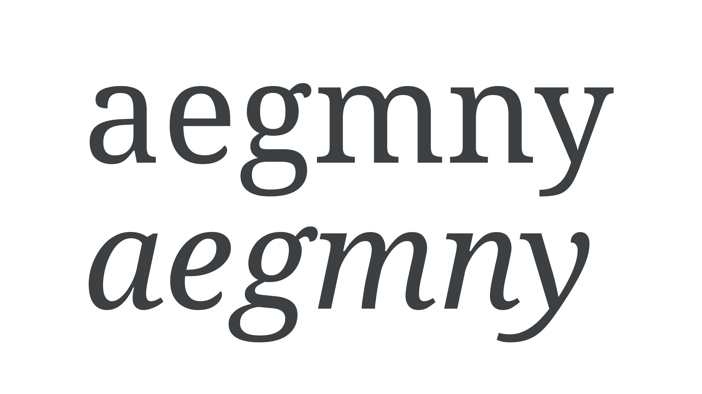

Italic is a [type](/glossary/type) [style](/glossary/style) that's almost always slanted and is designed to create emphasis in [text](/glossary/text_copy). Originally based on semi-cursive forms, italics are a direct contrast to the [upright](/glossary/regular_upright) style.

Unlike [obliques](/glossary/oblique), which are slanted versions of the upright forms, italics have a different structure informed by cursive handwriting—with their own nuances. Some italics differ wildly from their roman counterparts, such as those in [Bodoni Moda](https://fonts.google.com/specimen/Bodoni+Moda), [IBM Plex Serif](https://fonts.google.com/specimen/IBM+Plex+Serif?sort=date&category=Serif), and [Source Serif Pro](https://fonts.google.com/specimen/Source+Serif+Pro?sort=date&category=Serif).

<figure>

</figure>

When true italics (or true obliques) are not available, software may render [“faux“ italics](/glossary/faux_fake_pseudo_synthesized), which—like faux bolds and faux small-caps—should always be avoided.
