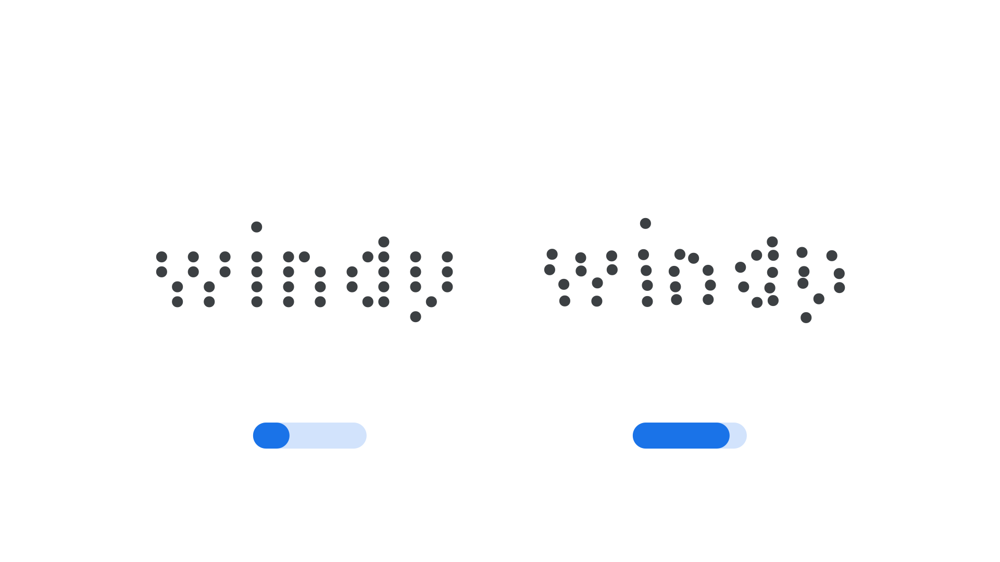

“Jitter” (`JITT` in CSS) is an [axis](/glossary/axis_in_variable_fonts) found in some [variable fonts](/glossary/variable_fonts) that applies irregular, randomized displacement to [glyphs](/glossary/glyph), emulating the mechanical imperfections of vintage printing equipment.

The [Google Fonts CSS v2 API](https://developers.google.com/fonts/docs/css2) defines the axis as:

| Default: | Min: | Max: | Step: |
| --- | --- | --- | --- |
| 0 | 0 | 100 | 1 |

<figure>

<figcaption>Typeface: <a href="https://fonts.google.com/specimen/Tiny5">Tiny5</a></figcaption>

</figure>

At 0, [characters](/glossary/character) sit precisely on the [baseline](/glossary/baseline) and align cleanly with one another. As the value increases, individual glyphs shift slightly and unevenly out of position, giving the text the displaced, uneven look of type printed by worn mechanical equipment such as dot-matrix or thermal printers.

Because the displacement is randomized rather than uniform, each [character](/glossary/character) is nudged by a different amount, which helps avoid the repetitive, obviously-patterned look that a simple uniform offset would produce.
