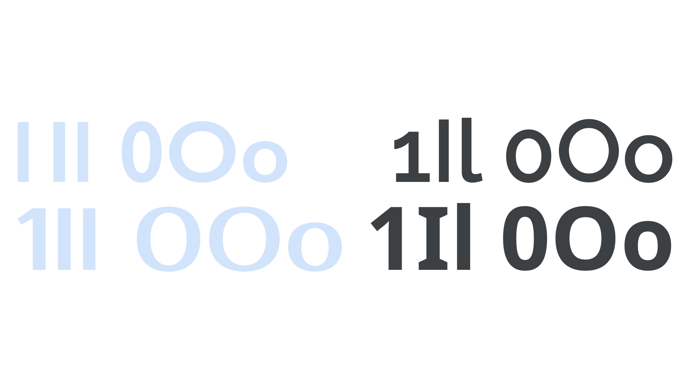

Legibility describes how a [typeface](/glossary/typeface)’s [glyphs](/glossary/glyph) can be correctly identified as [characters](/glossary/character) and words, including how individual characters can be distinguished from one another. Legibility should not be confused with [readability](/glossary/readability), although legibility does *affect* readability.

<figure>

</figure>

Some typefaces are inherently more legible than others, such as those with distinct shapes for “1,” capital “I,” and lowercase “l” (1Il); or “0”, capital “O,” and lowercase “o” (0Oo). Still, the [typography](/glossary/typography) of the [text](/glossary/text_copy) (for example, choices of foreground and background color, [font](/glossary/font) size, [weight](/glossary/weight), and [tracking](/glossary/tracking_letter_spacing)) will influence the legibility.

Legibility is a necessary prerequisite to readability; by affecting legibility, these factors also affect the readability of any [type](/glossary/type). A typeface rendered at a very small size will not be legible or readable. Increasing the font size will eventually make it legible, but it may not make it readable. For example, people may be able to read the text, but not comfortably—such as in a dense block of legal “small print.”

When the spacing between characters in a font is more open, it will be more legible, because that reduces crowding. You can add more space with tracking, and small [optical sizes](/glossary/optical_sizes) have more spacing and other optimizations built-in to increase their legibility. Some typefaces are designed to achieve extremely high legibility, such as [monospaced](/glossary/monospaced) fonts, or the typefaces used for car number plates.
