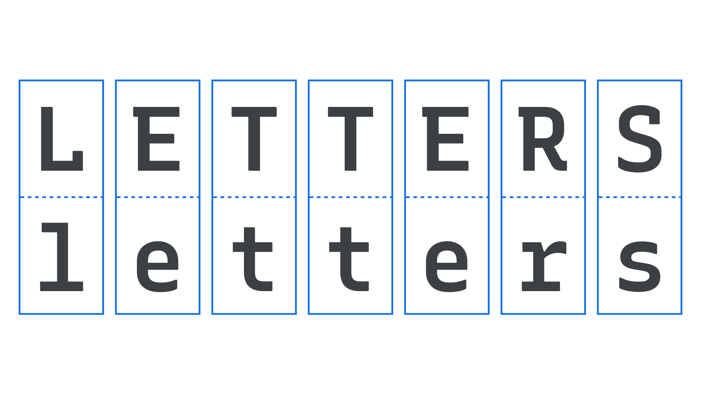

The set of graphical symbols used to represent speech sounds in an [alphabetic](/glossary/alphabet) [writing system](/glossary/script_writing_system) are generally referred to as letters. 

<figure>

</figure>

In linguistics, the atomic units of a writing system are called graphemes (similar in concept to [characters](/glossary/character) in [typography](/glossary/typography)); letters, which are associated with alphabets, constitute just one type of grapheme. 
 
In everyday discourse, however, people often use the term letters in a less restrictive sense. For example, they may refer to both the phonograms of the English alphabet (e.g., A, B, C) and to the signs/symbols used in the non-alphabetic Cherokee syllabary (e.g., ​​Ꭰ, Ꭷ, Ꭽ) as letters. 

In contrast, the term commonly used when referring to logograms, which are graphemes associated with writing systems like Chinese (e.g., 雨、月、人), is characters. In typography, phonograms, signs, symbols, and logograms may all be classified as characters.