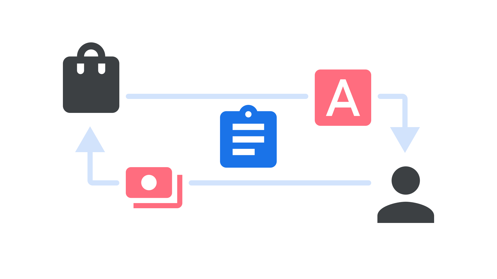

In typography, licensing refers to the terms of use and redistribution that are decided by a [type foundry](/glossary/type_foundry), as well as the process of obtaining a license by a user.

The license itself is a document that explicitly states what users can and can’t do with the [font](/glossary/font) files. Whether fonts are sold or given away for free, each has an associated license (and you *should* have a copy of the license for each font you have a copy of.) When you use a font, that implies you've agreed to those license terms.

<figure>

</figure>

Generally speaking, “licensing type” or “licensing fonts” refers to the purchasing process of obtaining legitimate copies of a retail font. It doesn’t change the number of font files that are provided at the point of sale; the license purchased (and therefore total cost of the transaction) relates to the volume or kind of usage permitted, such as the number of desktop users who can install the files, the number of unique visitors a website can serve the web font files to, or the ways the fonts can be embedded within an app.

Most licenses are written by lawyers for other lawyers to read, and often there is an accompanying “Frequently Asked Questions” (FAQ) document intended to clarify the meaning of the license. Type foundries are often quick to respond if you contact them to clarify your particular use-cases, for both retail and open source licenses.

The majority of open source fonts use the [SIL Open Font License](https://scripts.sil.org/ofl), which is written for a more general audience to read and understand, and also has an [extensive FAQ](https://scripts.sil.org/OFL-FAQ_web). 

This isn't legal advice, and if you do need legal advice please consider consulting a lawyer and always refer to the full license text for all details.
