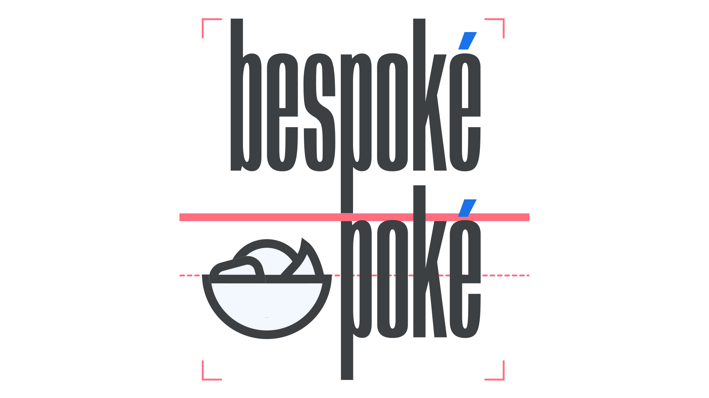

The fixed arrangement of two or more individual elements (e.g. a logomark together with a logotype) is often referred to as a lockup. 

<figure>

</figure>
<figcaption>A logo for a fictional brand. Note the customized diacritics, highlighted here in blue—made more prominent to fit with the overall weight of the type—and the guidelines, highlighted here in red, to show alignments and spacing specific to this lockup.</figcaption>

A lockup can even consist of *just* type. For instance, consider a logotype made up of two lines of text. The specific size of the type, the spacing between each line, and the overall position of the elements constitutes a lockup.
