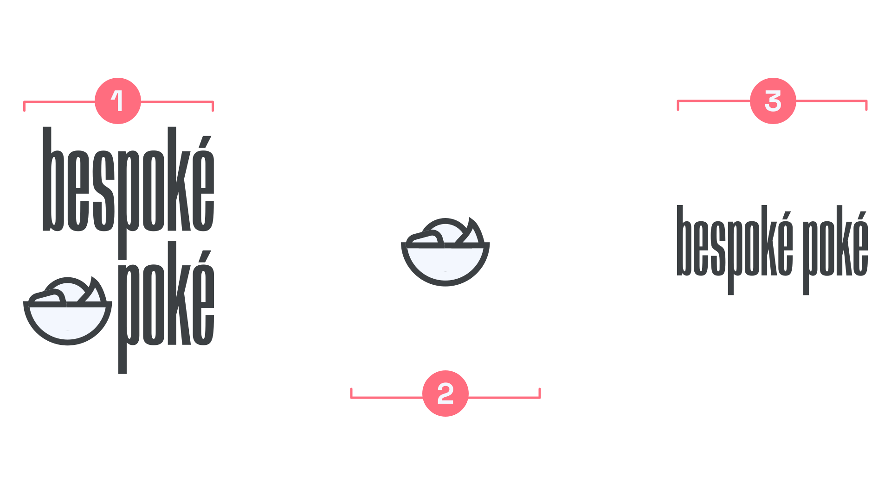

A logo is a unique combination of elements—usually graphics and type—that creates a reproducible and recognizable design. Depending on the brand and the context, these elements can also exist on their own.

<figure>

<figcaption>1 shows the full logo: a unique lockup of the logomark and logotype for a fictional brand, created using a customized version of <a href="https://fonts.google.com/specimen/Anybody">Anybody</a>. 2 shows the isolated logomark, suitable for use on social media avatars. 3 shows a logotype with a different arrangement to the one in the main logo, intended to be used when the logomark is absent. Note that the customized diacritics remain—this is not merely the brand name typed out in that font.</figcaption>

</figure>

A logomark is the graphic element, symbol, or icon (for example, Nike’s Swoosh, Starbucks’ siren, or Apple’s apple) that represents the company or brand. 

A logotype, which can also be known as a wordmark (although usually only if it’s made up of just one word), is a specific lockup of the brand’s name. It can be something as simple as a customized setting of a typeface (for instance, with custom kerning), an altered version that actually changes the  letterforms’ outlines, or a completely bespoke piece of lettering.

Combining a logomark and logotype together forms a logo, although it’s fair to say that the term “logo” is often used to refer to these individual elements, too.
