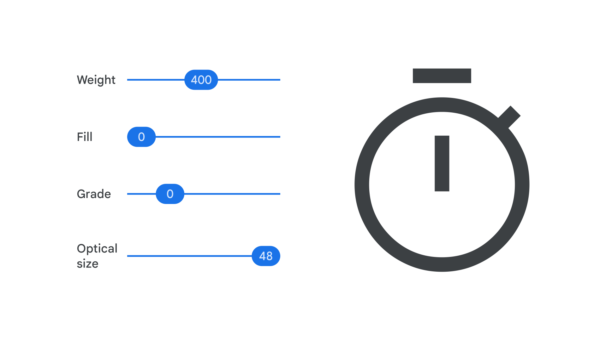

Google Fonts offers two collections as [icon fonts](/glossary/icon_font): [Material Icons](https://fonts.google.com/icons?icon.set=Material+Icons) and [Material Symbols](https://fonts.google.com/icons?icon.set=Material+Symbols). The Material Symbols [font](/glossary/font) is the [variable](/glossary/variable_fonts) version of the Material Icons font, combining over 2,000 [glyphs](/glossary/glyph) into a single font file with a wide range of design variants, adjusted by variable [axes](/glossary/axis_in_variable_fonts).

<figure>

</figure>

Both Material Icons and Material Symbols support three styles: Outlined, Rounded, and Sharp. Material Icons also supports a two-tone and a filled version. However, the variable axes in Material Symbols allow for further refinement. The axes allow you to vary [weight](/glossary/weight_axis), [fill](/glossary/fill_axis), [optical size](/glossary/optical_size_axis), and [grade](/glossary/grade_axis). This fine level of control allows the icons to be adjusted to perfectly match any [type](/glossary/type) they might sit alongside.

Material Symbols can also be incorporated into working design files thanks to [the official Figma plugin](https://www.figma.com/community/plugin/1088610476491668236/Material-Symbols).
