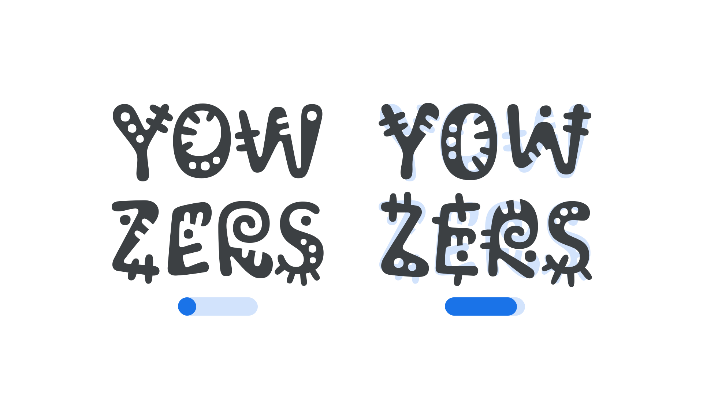

“Morph” (`MORF` in CSS) is an [axis](/glossary/axis_in_variable_fonts) found in some [variable fonts](/glossary/variable_fonts) that can be used to unconventionally change the shape, size, and position of elements that make up a letterform. 

The [Google Fonts CSS v2 API](https://developers.google.com/fonts/docs/css2) defines the axis as:

| Default: | Min: | Max: | Step: |
| --- | --- | --- | --- |
| 0 | 0 | 60 | 1 |

<figure>

</figure>

In the [Kablammo](https://fonts.google.com/specimen/Kablammo) font, moving along the axis from its minimum to maximum value animates the elements that are changing. Some [glyphs](/glossary/glyph) use this to suggest actual movement as the axis is altered.