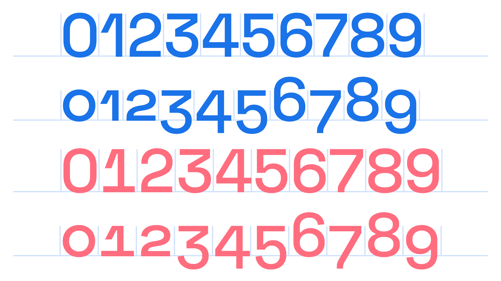

Numerals or figures are the [glyphs](/glossary/glyph) in a [typeface](/glossary/typeface) that represent numbers. In many [fonts](/glossary/font), it’s possible to select different kinds of numerals intended for different uses.

<figure>

</figure>

Numerals can either be “lining” (uppercase-like), or “oldstyle” (lowercase-like), or “proportional” (with varying character width), or “tabular” (with a unified character width, a la [monospaced](/glossary/monospaced) [type](/glossary/type)). Therefore, there are effectively four flavors of numeral. Explore them at length in our article, [“Understanding numerals”](/lesson/understanding_numerals).
