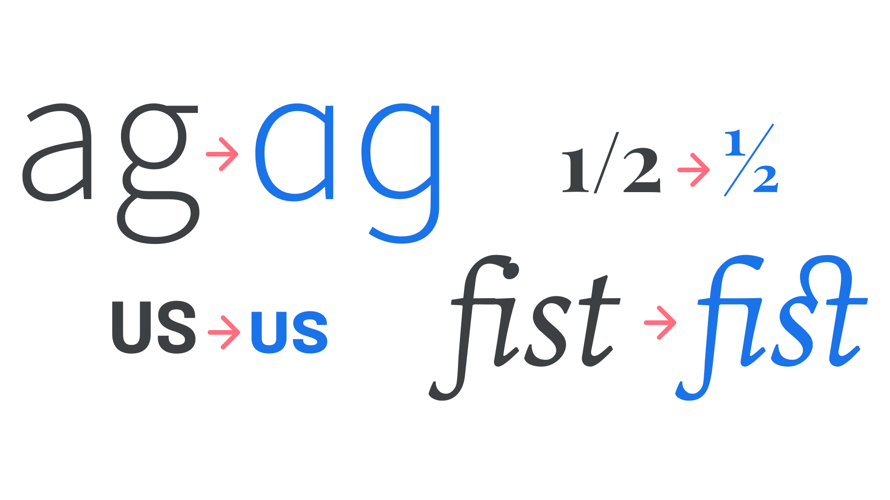

OpenType is a [font](/glossary/font) technology and associated [font format](/glossary/font_format), developed by Microsoft and Adobe in the 1990s, which allows the end user to access additional features in a font.

<figure>

</figure>

OpenType became widely adopted on the web around 2010–2015, bringing previously print-specific features such as [kerning](/glossary/kerning_kerning_pairs), [ligatures](/glossary/ligature), [numerals](/glossary/numerals_figures), etc. to websites.

OpenType was recently expanded to allow for [variable fonts](/glossary/variable_fonts), whose proper term is OpenType Font Variations.
