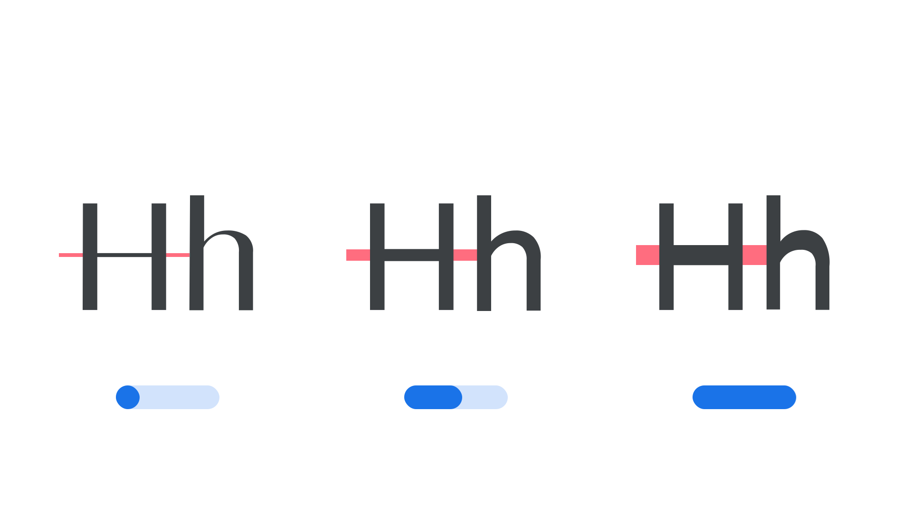

A parametric [axis](/glossary/axis_in_variable_fonts) in a [variable font](/glossary/variable_fonts) is one that adjusts only one singular aspect of a [typeface](/glossary/typeface) as a “parameter.” These axes are high-precision tools intended only for expert use, as they offer a bridge between the worlds of [type designer](/glossary/type_designer) and [typographer](/glossary/typographer), affording expert users some of the powers of fine-tuning typefaces that were previously reserved for [type foundries](/glossary/type_foundry).

<figure>

</figure>

They are useful by themselves to tune a single aspect of [weight](/glossary/weight), [width](/glossary/width) or height, but are often be modified in concert with other axes or settings in order to obtain a desirable impact on our typography. Knowing what the desirable changes are, and which sets of adjustments to make, requires experience and expertise.

Yet these kinds of enhancements can be packaged into “smart” functionality that optimizes typography for designers and users who do not need to understand the internal mechanics. For example, the [Parametric Counter Width axis (XTRA)](/glossary/xtra_axis) can be used alongside adjustments to word spacing and letter spacing to improve [justification](/glossary/alignment_justification), as [demonstrated in Type Network’s variable fonts brochure](https://variablefonts.typenetwork.com/topics/spacing/variations).

Explore more in our article, [“Introducing parametric axes.”](/lesson/introducing_parametric_axes)
