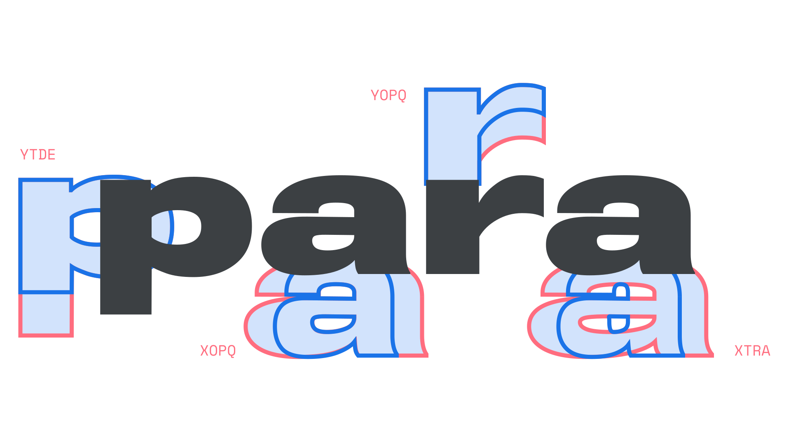

A parametric [font](/glossary/font) is a [variable font](/glossary/variable_fonts) where one or more of its [axes](/glossary/axis_in_variable_fonts) are [parametric axes](/glossary/parametric_axis), such as [Roboto Flex](https://fonts.google.com/specimen/Roboto+Flex?query=roboto+flex) or [Amstelvar](https://github.com/googlefonts/amstelvar). Unlike expressive variation axes like [Weight](/glossary/weight_axis) and [Width](/glossary/width_axis), parametric axes adjust attributes of typefaces that are detailed, measurable, and have values that can be reused across fonts.

<figure>

</figure>

Because many axis settings in parametric fonts result in visually unappealing fonts, it is recommended that users adjust parametric fonts by using the expressive variation axes first, then fine-tune using the parametric axes.

For more information, please read our article, [“Introducing parametric axes.”](/lesson/introducing_parametric_axes)
