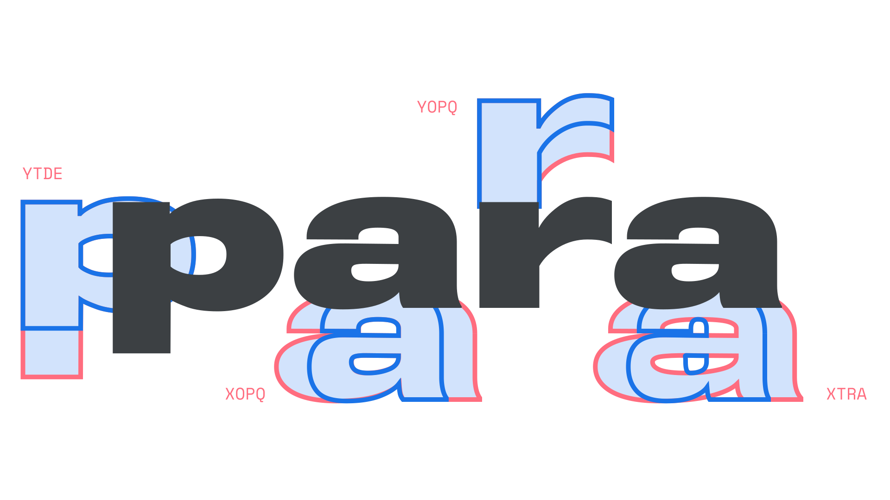

A parametric [font](/glossary/font) is a [variable font](/glossary/variable_fonts) where one or more of its [axes](/glossary/axis_in_variable_fonts) are [parametric axes](/glossary/parametric_axis), such as [Roboto Flex](https://fonts.google.com/specimen/Roboto+Flex?query=roboto+flex).
Parametric axes adjust specific attributes of a typeface that are detailed, measurable, and have values that can be reused across fonts.

<figure>

</figure>

We recommended that you adjust parametric axes only after setting more typical axes like Weight, Width and Optical Size first, then using parametric axes to finesse details.

Parametric axes are sensitive instruments for fine-tuning type, and using them delicately will result in visually perfect typography – but using them bluntly can easily create unappealing type styles.

For more information, please read our article, [“Introducing parametric axes.”](/lesson/introducing_parametric_axes)
