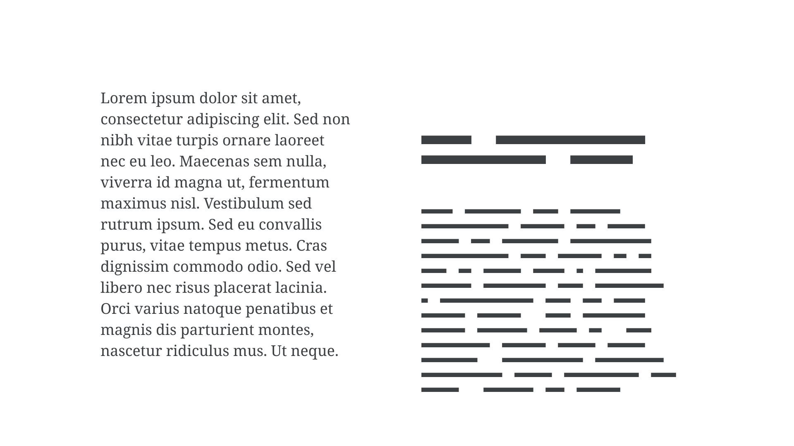

[Text](/glossary/text_copy) that is set temporarily in place of actual copy is called “placeholder text” or “dummy text.” It often takes the form of “lorem ipsum”—a sequence of words from a work of classical literature that is deliberately intended to not be read (in modern times). This is often erroneously called “Greeked.” The term can also mean display of placeholder text that is rendered as gray bars to speed rendering of the page.

<figure>

</figure>

The purpose of any placeholder text, including lorem ipsum, is to indicate that the text is not there to be read, which is why it’s used in design mockups, where the viewer should be focussing on the overall design, and in type specimens, where the reader should be focussing on the [characters](/glossary/character)’ personality and design, and overall [typographic color](color).
