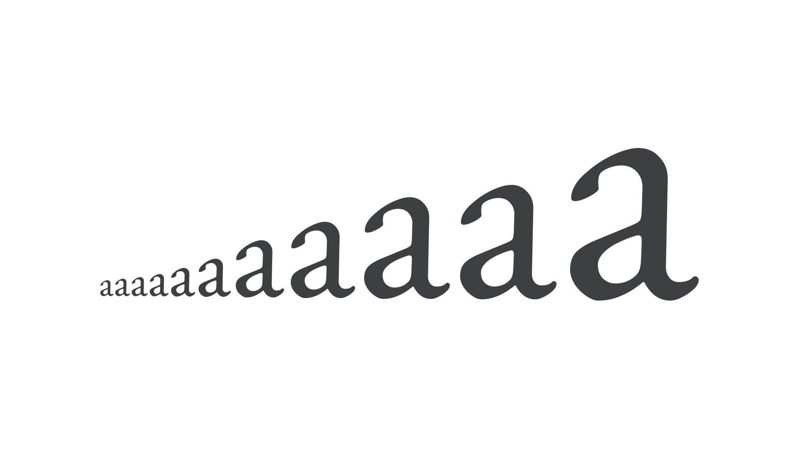

“Point” is one of many [units](/glossary/unit) of measurement for [type](/glossary/type) and the default unit used in contemporary print design. Like the pixel, the point is an absolute unit, as opposed to a relative unit such as an [em](/glossary/em), [en](/glossary/en), or rem.

<figure>

</figure>

The actual physical size of a point has varied throughout history, but since the mid-1980s, one point is equivalent to 1/72nd of an inch in print. Browsers have no concept of physical size and, although the size of an actual pixel varies, CSS defines a point as 1⅓ pixels.

But what is the point size of a [font](/glossary/font)? Font rendering on screen or in print starts with scaling the font’s em to the desired point size. But there’s no specific part of a font that equals the point size, nor any combination of parts that necessarily add up to the point size. For Latin-based languages, the  average [capital height](/glossary/cap_height) is about 70% of the point size. In an average font, the [x-height](/glossary/x_height) is roughly half the point size. The font bounding box may approximately equal the point size, but there is no specific, required relationship. Thus, how large a given font is at a given point size varies, and is font-specific. If you set two different fonts at 16 point, very likely one will be larger than the other.
