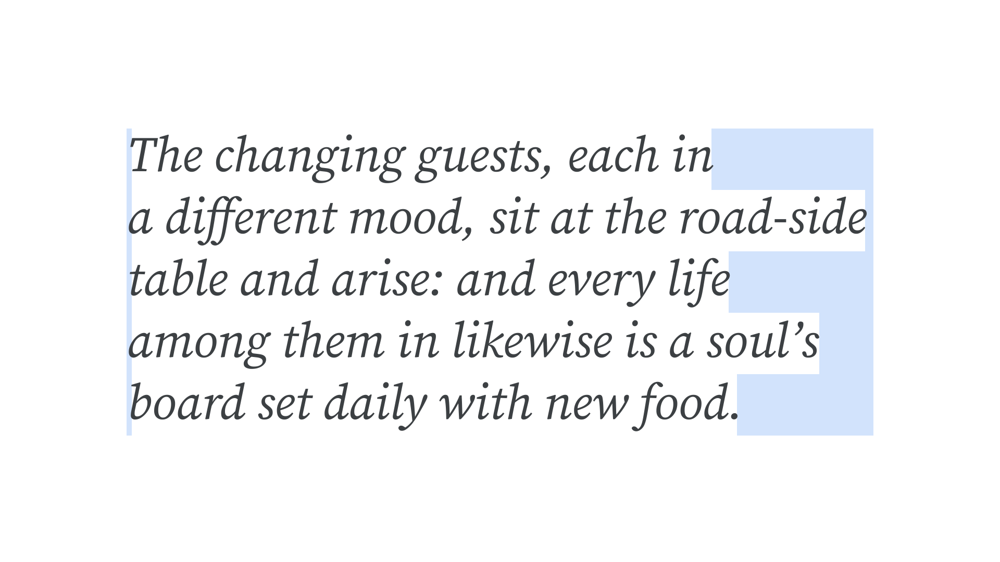

The rag refers to the irregular edge of an [unjustified](/glossary/alignment_justification) [text](/glossary/text_copy) block. “Ragged right” is another term for left-justified text, and “ragged left” means right-justified. 

<figure>

</figure>

Center-aligned [type](/glossary/type) has two rags: both left and right. Fully justified text has no rag, since glyphs touch both the right and left sides of the text block.
