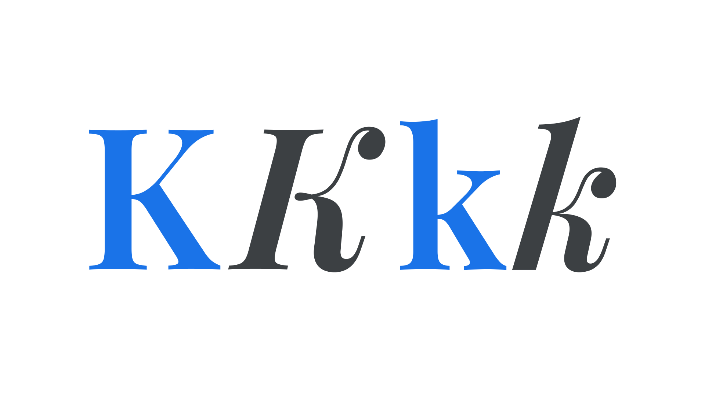

“Regular” can refer to the regular [weight](/glossary/weight), usually assigned the `font-weight` value of 400 in CSS, or the regular/upright (i.e., non-[italic](/glossary/italic) or [oblique](/glossary/oblique)) [style](/glossary/style) of a [typeface](/glossary/typeface).

<figure>

</figure>

When referring to the style—that is, whether the typeface is changing between and upright and italic (or oblique)—it’s usually best to add clarity by referring to the Regular as “upright” type. However, note that in CSS, the upright style is referred to as “normal”; i.e., `font-style: normal;`.

“Regular” might also refer to type’s [width](/glossary/width) when there are [condensed](/glossary/condensed_narrow_compressed) or [wide](/glossary/wide_extended) variants available, although this is not often named explicitly.
