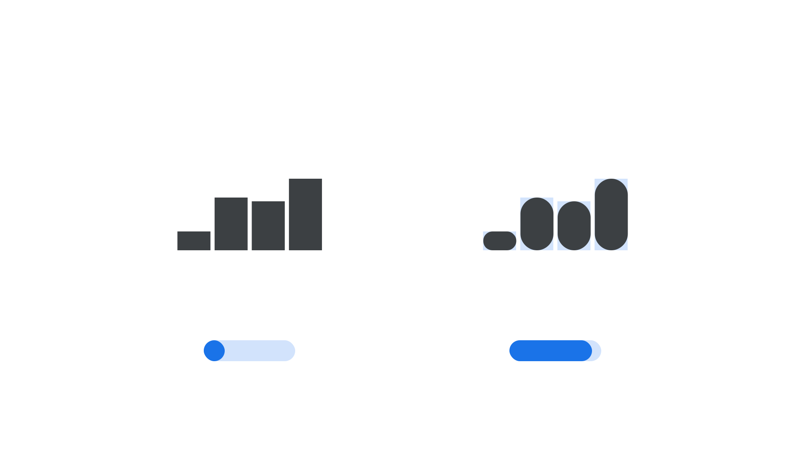

“Roundness” (`ROND` in CSS) is an [axis](/glossary/axis_in_variable_fonts) found in some [variable fonts](/glossary/variable_fonts) that can be used to change shapes from sharp and angular defaults to rounded versions.

The [Google Fonts CSS v2 API](https://developers.google.com/fonts/docs/css2) defines the axis as:

| Default: | Min: | Max: | Step: |
| --- | --- | --- | --- |
| 0 | 0 | 100 | 1 |

<figure>

</figure>

In [Wavefont](https://fonts.google.com/specimen/Wavefont), manipulating this axis results in changing the rectangular bar chart style to one that has a large border radius at the top and bottom of each bar. This axis is similar, but subtly different, to the [Softness axis](/glossary/softness_axis) (`SOFT`).