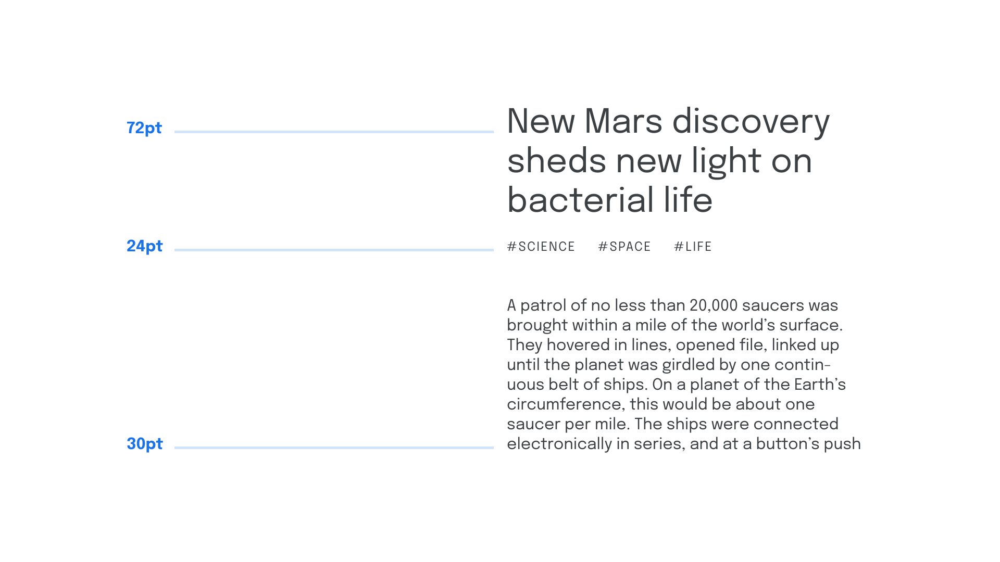

A typographic scale refers to a pre-defined set of intervals that dictate font sizes within a typographic system.

<figure>



</figure>

Much like scales in music, it’s not harmonious to play every possible note/use every available [font](/glossary/font) size—it’s better to limit ourselves to a few that have an explicit relationship to each other.

Default font sizes found on most software are:

```
6, 7, 8, 9, 10, 11, 12, 14, 16, 18, 21, 24, 36, 48, 60, 72, 96
```

In practice, however, a scale can be made up of any interval. And, if those intervals between each size have a relationship with each other, the scale is much more likely to be harmonious. Consider the following:

```
Body font size  = 1rem
Heading level 3 = 2rem
Heading level 2 = 4rem
Heading level 1 = 8rem
```

And, to draw further inspiration from music, we could take the intervals found in harmonious musical scales and use math to translate them into type.  More information on—and calculators for—translating musical scales to typographic scales can be found on [Spencer Mortensen’s article on the typographic scale](https://spencermortensen.com/articles/typographic-scale/) and Jean-Lou Désiré’s [Typographic Scale Calculator](http://www.layoutgridcalculator.com/typographic-scale/)—with notes about the latter on [“The Typographic Scale—Reworked!”](https://medium.com/@tilougarou/the-typographic-scale-reworked-a1b441b2beb2)

Exactly how you choose your scale comes down to personal preference; the important thing is is to choose what allows for consistency to be achieved within your typographic system.
