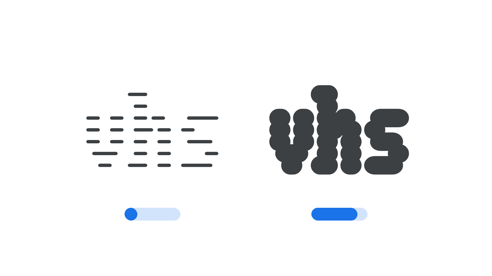

“Scanlines” (`SCAN` in CSS) is an [axis](/glossary/axis_in_variable_fonts) found in some [variable fonts](/glossary/variable_fonts) that control the thickness of the scanlines that make up the [glyph](/glossary/glyph) shapes. Because it’s only the scanlines that are changed, there are no changes to the type’s overall [width](/glossary/width), [letter spacing](/glossary/tracking_letter_spacing), or [kerning](/glossary/kerning_kerning_pairs). Therefore, Manipulating this axis will not result in altered line breaks or page layout changes.

The [Google Fonts CSS v2 API](https://developers.google.com/fonts/docs/css2) defines the axis as:

| Default: | Min: | Max: | Step: |
| --- | --- | --- | --- |
| 0 | -100 | 100 | 1 |

<figure>

<figcaption>In the <a href="https://fonts.google.com/specimen/Workbench">Workbench</a> typeface, note how moving the Scanline axis towards its maximum value expands the height of each individual scanline.</figcaption>
</figure>

Negative values make the scanlines thinner, and positive values make them thicker.
