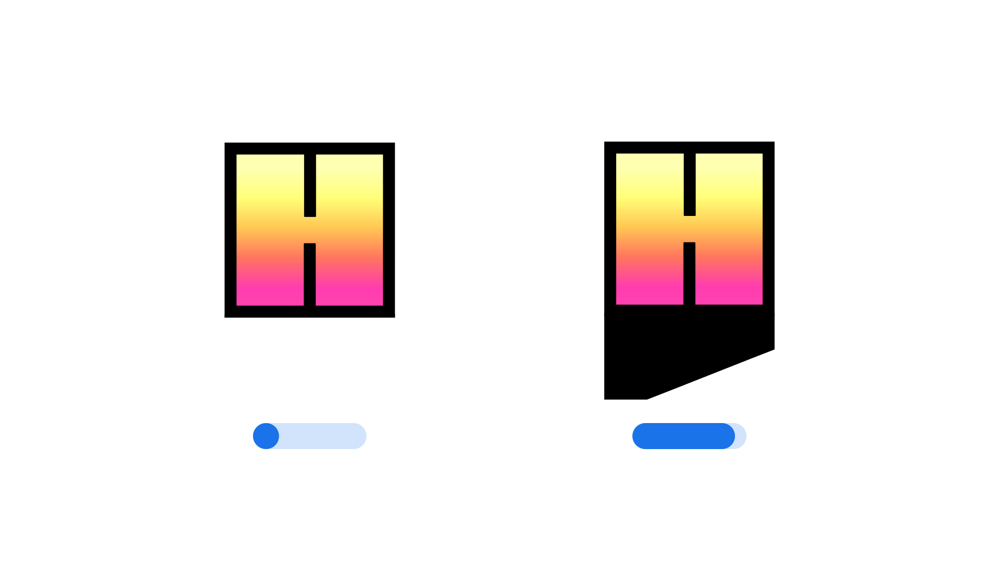

"Shadow Length" (`SHLN` in CSS) is an [axis](/glossary/axis_in_variable_fonts) found in some [variable fonts](/glossary/variable_fonts) that controls the length of a shadow applied to letterforms, allowing to add depth and dimension to a typeface.

The [Google Fonts CSS v2 API](https://developers.google.com/fonts/docs/css2) defines the axis as:

| Default: | Min: | Max: | Step: |
| --- | --- | --- | --- |
| 50 | 0 | 100 | 1 |

<figure>

<figcaption>A letterform from the <a href="https://github.com/EkType/Honk">Honk</a> typeface.</figcaption>
</figure>

Changes along the Shadow Length axis increase or decrease the shadow applied to each letterform. At 0%, the shadow length is zero, while at 100% the shadow reaches the maximum length defined by the typeface’s design. The default value of 50% places the shadow midway between these extremes.

The axis uses a percentage-based scale relative to each family’s design, where 0% produces no shadow and 100% applies the maximum shadow length intended by the type designer.
