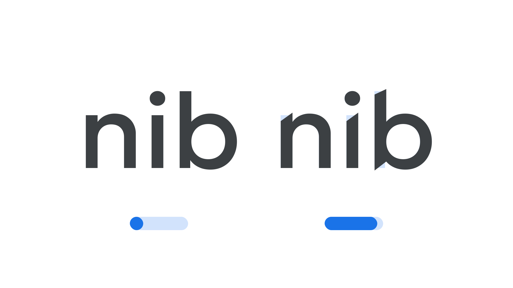

“Sharpness” (`SHRP` in CSS) is an [axis](/glossary/axis_in_variable_fonts) found in some [variable fonts](/glossary/variable_fonts) that can be used to adjust the shape of the [letterforms](/glossary/letterform)’ [terminals](/glossary/terminal). At its default value of 0, terminals are blunt, but they become sharper in appearance as the axis moves towards its maximum value of 100%.

The [Google Fonts CSS v2 API](https://developers.google.com/fonts/docs/css2) defines the axis as:

| Default: | Min: | Max: | Step: |
| --- | --- | --- | --- |
| 0 | 0 | 100 | 1 |

<figure>

<figcaption>Typeface: <a href="https://fonts.google.com/specimen/Geologica">Geologica</a></figcaption>
</figure>

Type designers can increase the sharpness of their designs in obvious ways, but also with subtle attention to detail. For example, in the Geologica typeface, it’s not just one terminal’s extreme point that gets moved up or down as a result of this sharpening — the adjacent point also shifts down ever so slightly to compensate for this new form, which is especially noticeable in the undershoot at the bottom of the stem of the “b” in the illustration above.

The number system of the axis is a relative percentage, where the default sharpness is zero and the maximum is 100%.

This axis is conceptually the opposite of the [Softness axis](/glossary/softness_axis) (`SOFT`).