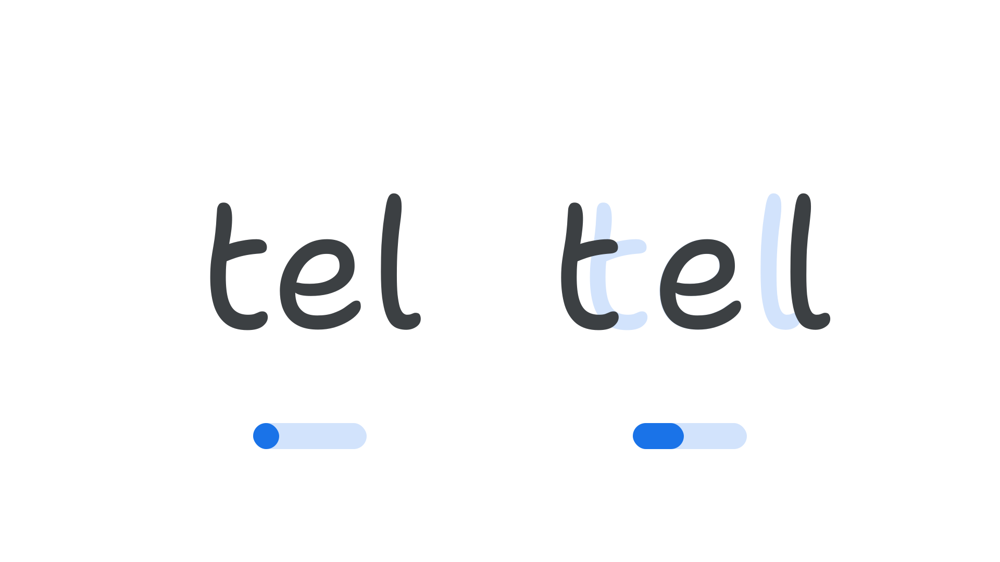

“Spacing” (`SPAC` in CSS) is an [axis](/glossary/axis_in_variable_fonts) found in some [variable fonts](/glossary/variable_fonts) that can be used to adjust the spacing among characters overall, as a percentage from the default spacing.

The [Google Fonts CSS v2 API](https://developers.google.com/fonts/docs/css2) defines the axis as:

| Default: | Min: | Max: | Step: |
| --- | --- | --- | --- |
| 0 | -100 | 100 | 0.1 |

<figure>

<figcaption>The letters “tel” in <a href="https://fonts.google.com/specimen/Shantell+Sans">Shantell Sans</a>, with default spacing and the axis range shown below it at a default value of zero, and then to the right the same letter again but spaced far apart, with the axis value shown increased around 33%.</figcaption>
</figure>

Manipulating this axis has the same effect as adjusting the tracking value (called letter-spacing in CSS); therefore it can alter the personality of the type in the same way as tracking can, and — as with the [Shantell Sans](https://fonts.google.com/specimen/Shantell+Sans) font — that effect can be further exaggerated by manipulating axes like [Bounce](/glossary/bnce_axis) (`BNCE`) and Spacing in tandem. 

The number system of the axis is a relative percentage, where the default spacing is zero,the minimum spacing is -100%, and the maximum (widest) spacing is 100%, with values up to one decimal place (e.g. 97.5%).

Manipulating the Spacing axis can be better than adjusting [tracking](/glossary/tracking_letter_spacing) settings because it’s often much more fine-grained (compared to the CSS `letter-spacing` property) and offers the type designer an opportunity to structure changes to spacing in a sophisticated way, specific to each typeface. Fonts with a Spacing axis can be used to better finesse animations, and apply tracking adjustments in software which do not provide built-in support for tracking yet do support variable fonts.

For font developers, Google Fonts has commissioned a reference implementation of the Spacing axis, and tools to implement it, at [github.com/googlefonts/roboto-flex-spacing-axis-demo](https://github.com/googlefonts/roboto-flex-spacing-axis-demo).