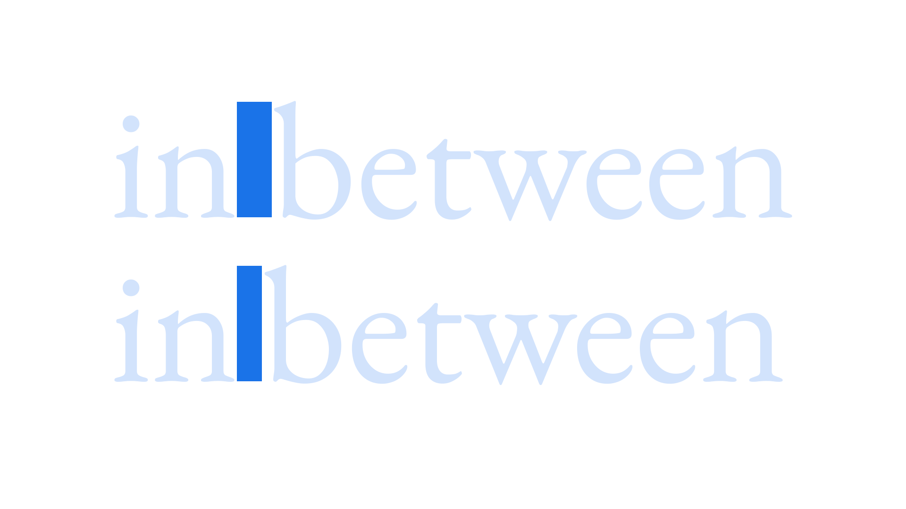

Spaces are [glyphs](/glossary/glyph) that contain no visible [strokes](/glossary/stroke) but still have specific values for width, and occupy a unique [unicode](/glossary/unicode) cell in the glyph table.

<figure>

</figure>

A **hair space** is the thinnest of all spaces and can be used either side of an [en dash or em dash](/glossary/dashes)—although that’s down to the style guide we’re referencing. A **thin space** is slightly wider (around 15%–20% of an [em](/glossary/em)) and again can be employed around dashes according to the preferences of the style guide. 

**Non-breaking spaces** are added between words that need to stay together in any event. If the last word in the sequence doesn’t fit on the end of the line, all words connected with non-breaking spaces will shift to the next line. This is useful when avoiding [orphans](/glossary/widows_orphans), but should be [used with care](/lesson/avoiding_widows_orphans).
