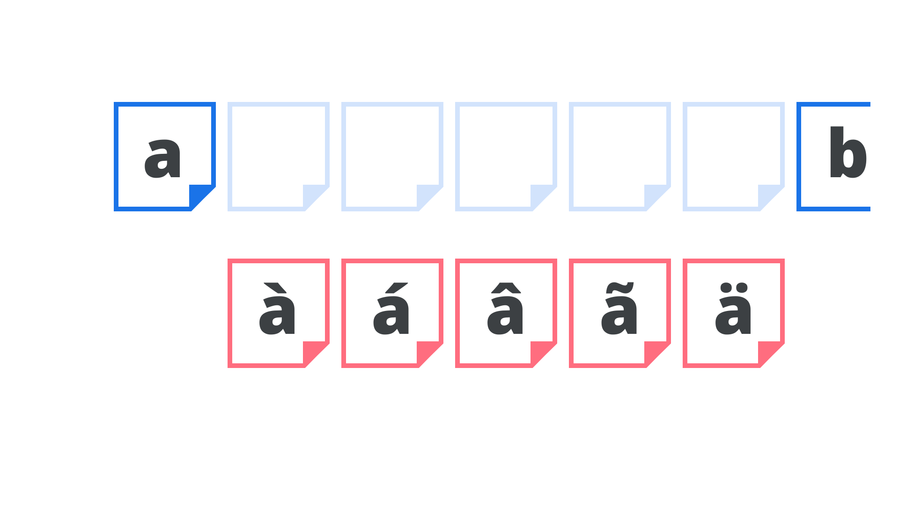

Subsetting is the practice of creating a “subset” of a [font](/glossary/font)—a file that contains a custom (and usually limited) collection of [glyphs](/glossary/glyph).

<figure>

</figure>

There are numerous scenarios where subsetting may be desirable:

1. When a [font delivery service](/lesson/using_web_fonts_from_a_font_delivery_service) wishes to optimize the [file size](/glossary/file_size) of a [web font](/glossary/web_font).
2. When a [foundry](/glossary/type_foundry) wishes to offer a limited [character](/glossary/character) set as a trial font.
3. When a developer wishes to strip unrequired languages from a web font.
4. When a foundry (or [designer](/glossary/type_designer)) wishes to distribute a collection of glyphs for a specifics use, as was the way with [small caps](/glossary/small_caps) or [stylistic sets](/glossary/stylistic_sets) prior to the arrival of [OpenType](/glossary/open_type).
5. When a foundry wishes to create a customized collection of glyphs (perhaps with modifications) for a client.

There are many online services that can generate subsets for the user on-the-fly, but it’s important to consider whether a particular [font license](/glossary/licensing) allows for subsetting or not.
