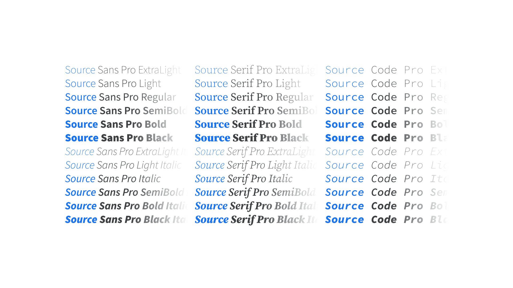

A superfamily is the collective grouping of several explicitly related [type](/glossary/type) [families](/glossary/family_or_type_family_or_font_family)—such as a [serif](/glossary/serif), [sans](/glossary/sans_serif), and [slab](/glossary/slab_serif_egyptian_clarendon)—that all share the same underlying structure to their design.

<figure>

</figure>

It’s common for a [typeface](/glossary/typeface) to be made up of several variants—usually [weight](/glossary/weight)s—and this is referred to as a “family.” When the variants are more plentiful, especially when the family includes variants across typeface genres (e.g. serif and sans), it can be referred to as a “superfamily.” Variable fonts make it possible to deploy an entire superfamily as a single font file.

Examples of superfamilies include [Source](https://fonts.google.com/?query=source) ([Sans](https://fonts.google.com/specimen/Source+Sans+3), [Serif](https://fonts.google.com/specimen/Source+Serif+4), [Code](https://fonts.google.com/specimen/Source+Code+Pro)), [IBM Plex](https://fonts.google.com/?query=ibm+plex) ([Sans](https://fonts.google.com/specimen/IBM+Plex+Sans), [Sans Condensed](https://fonts.google.com/specimen/IBM+Plex+Sans+Condensed), [Serif](https://fonts.google.com/specimen/IBM+Plex+Serif), [Mono](https://fonts.google.com/specimen/IBM+Plex+Mono)), and [Roboto](https://fonts.google.com/?query=roboto) ([Sans (Flex)](https://fonts.google.com/specimen/Roboto+Flex), [Sans (Classic)](https://fonts.google.com/specimen/Roboto), [Sans Condensed (Classic)](https://fonts.google.com/specimen/Roboto+Condensed), [Serif](https://fonts.google.com/specimen/Roboto+Serif), [Slab](https://fonts.google.com/specimen/Roboto+Slab), [Mono](https://fonts.google.com/specimen/Roboto+Mono)).
