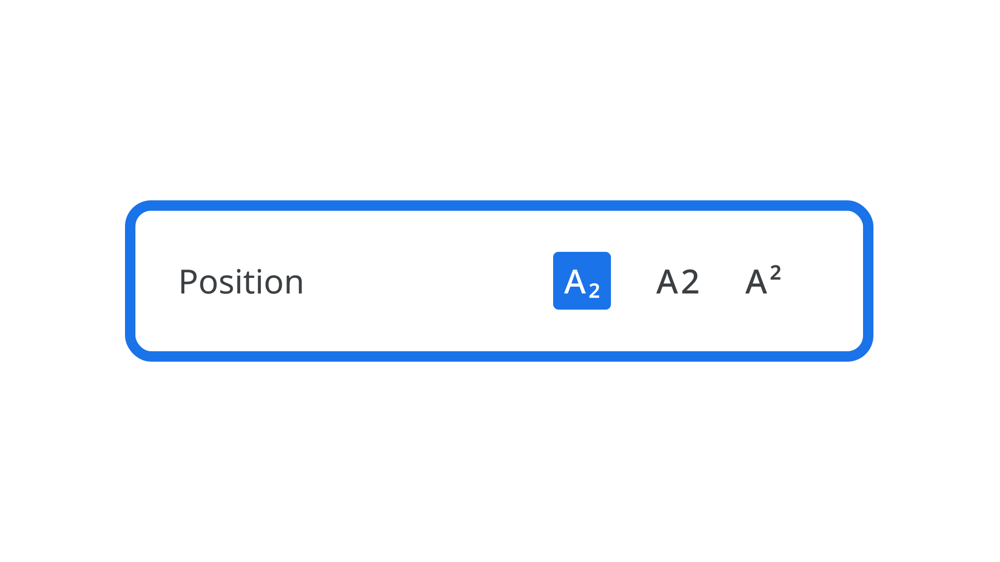

Superscript is [text](/glossary/text_copy) formatted to appear smaller than the surrounding text and is usually aligned slightly above the top of the regular [type](/glossary/type); subscript is similar, but aligned slightly below the baseline. In English, superscript is commonly used to add references (for footnotes), copyright or trademark symbols, and in equations for scientific and mathematical texts. Subscript is mainly reserved for chemical compounds.

<figure>

<figcaption>Typefaces: <a href="https://fonts.google.com/specimen/EB+Garamond">EB Garamond</a>, <a href="https://fonts.google.com/specimen/Space+Grotesk">Space Grotesk</a>, <a href="https://fonts.google.com/noto/fonts">Noto Sans</a></figcaption>

</figure>

Superscript and subscript can be easily applied to text with controls in most user interfaces, from word processors to design applications.

<figure>

</figure>

Although it’s possible for software to synthesize the smaller sizes, it’s best to use the correct superscript and subscript [glyphs](/glossary/glyph) in a [font](/glossary/font) file, if they exist—much like [avoiding faux small caps](/lesson/choosing_reliable_typefaces).
