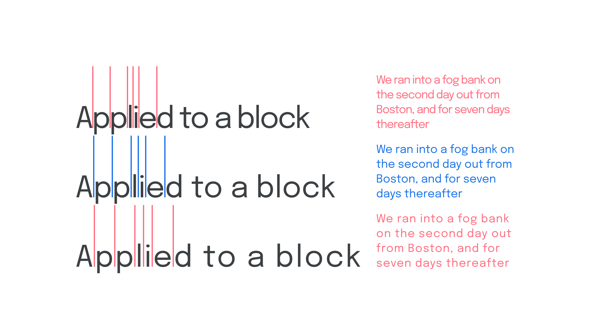

Tracking is the spacing between [glyphs](/glossary/glyph) applied to an entire piece of [text](/glossary/text_copy). In CSS, this is called `letter-spacing`.

<figure>

<figcaption>Too tight, just right, and too open.</figcaption>

</figure>

Providing more open tracking—i.e., more space between the letters—usually helps with the [readability](/glossary/legibility_readability) of [all-caps](/glossary/all_caps) text. Negative tracking—i.e., a value less than “0”—is usually not encouraged unless the type is being set at very large (i.e., [display](/glossary/display)) sizes.

Many novice typographers mistakenly talk about [kerning](/glossary/kerning_kerning_pairs) when they actually mean tracking. Kerning is the customised spacing between two particular glyphs, whether that’s kerning pairs in the font itself (defined by the [type designer](/glossary/type_designer), or a custom kern by the end user, such as in logo creation.

Note that some software (including browsers) may disable [ligatures](/glossary/ligature) when kerning or tracking is applied.
