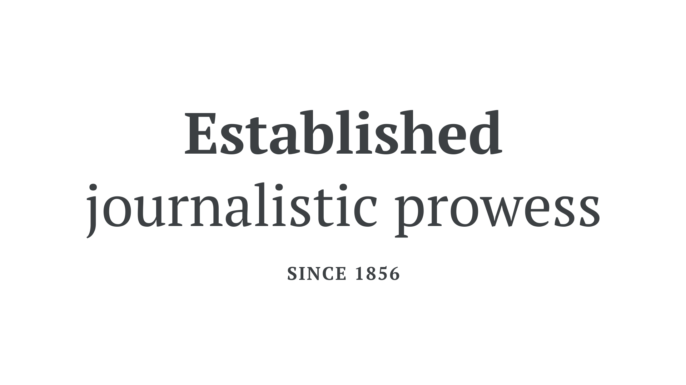

Transitional or Neo-classical (sometimes stylized as Neoclassical) is a historical [classification](/glossary/classification) for [typefaces](/glossary/typeface) that reference elements of human penmanship—à la [Humanist](/glossary/humanist_old_style) faces. But they do so in a more ordered and structured form, usually with a higher [stroke](/glossary/stroke) [contrast](/glossary/contrast), a more upright [axis](/glossary/axis_in_type_design), and more symmetry. Didone (or Modern) faces are often interchangeable with this grouping, too, although they usually exhibit an even greater stroke contrast.

<figure>

</figure>

It’s important to note that, like all historical classifications, transitional typefaces that fit this style don’t necessarily come from this period in history. Examples of transitional typefaces include [Merriweather](https://fonts.google.com/specimen/Merriweather), [PT Serif](https://fonts.google.com/specimen/PT+Serif?query=pt+serif), and—on the Didone end of the spectrum—[Playfair Display](https://fonts.google.com/specimen/Playfair+Display).
