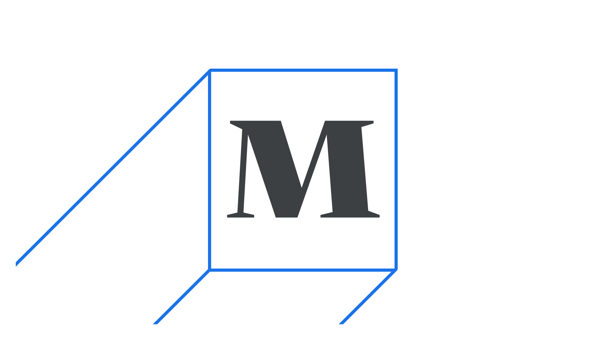

Type is the mechanized and consistent reproduction of [letterforms](/glossary/letterform) for written language.

<figure>

</figure>

Prior to the invention of type and the machinery used to [set](/glossary/typesetting) type, humankind was limited to writing everything by hand, with hand-copying being the only means of “reproducing” [text](/glossary/text_copy). In that sense, it’s hard not to overstate the profound revolution that the invention of printing with moveable type brought to humankind.

When discussing typography, talking about type usually means focussing on the details that make up the [design](/glossary/type_designer) of the [characters](/glossary/character) in a [typeface](/glossary/typeface), as well as the overall effect that [typographic choices](/glossary/typography) have on the reader’s perception of that type.

Today at Google Fonts, the term “type” refers to all kinds of font assets, from text and display typefaces to icons and emoji.
