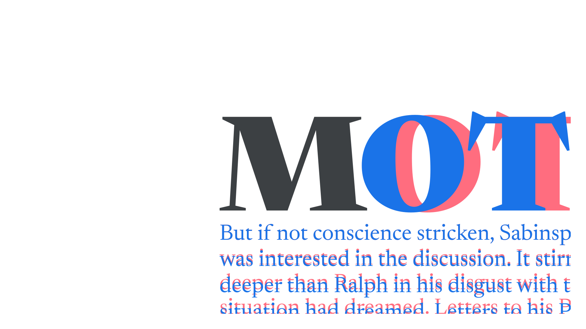

Typography is the practice of making informed decisions about the [setting](/glossary/typesetting) of [type](/glossary/type). Not to be confused with [type design](/glossary/type_designer).

<figure>

</figure>

Choosing [typefaces](/glossary/typeface) isn’t actually a part of typography, although it’s an act usually discussed at the same time. Changes to [font weights](/glossary/weight), [line height](/glossary/line_height_leading), [measure (line length)](/glossary/measure_line_length), and so much more constitute the art and science of typography.

Good typography first ensures the message is communicated, then influences *how* the message is communicated.
