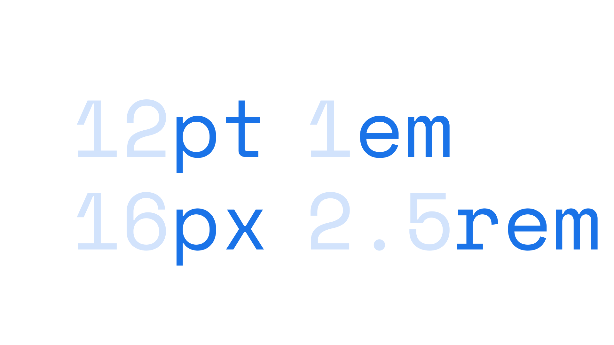

A unit is a way of measuring [font](/glossary/font) size, [line height](/glossary/line_height_leading), [line length](/glossary/measure_line_length), margins, or virtually anything in the practice of [typography](/glossary/typography). Multiple units are in existence, including many historic ones, but points, pixels, and ems (or rems) are the units most relevant to today’s digital [typesetting](/glossary/typesetting) needs. Units mark the key integers in a typographic [scale](/glossary/scale).

<figure>

</figure>

Some units are *absolute*—they will always appear at exactly the same size (points, picas, inches, centimeters)—and some units are *relative*—their final size is dependent on their relation to other properties (percentages, ems, rems, viewport height, viewport maximum size, etc.).

In print, it usually makes the most sense to focus on absolute units. On the web and in apps, it usually makes the most sense to focus on relative units. It could be argued that pixel is both an absolute *and* relative unit, because although it takes no cues from other elements (in the way that rems or percentages might), the exact physical size of a pixel varies between computing devices.
