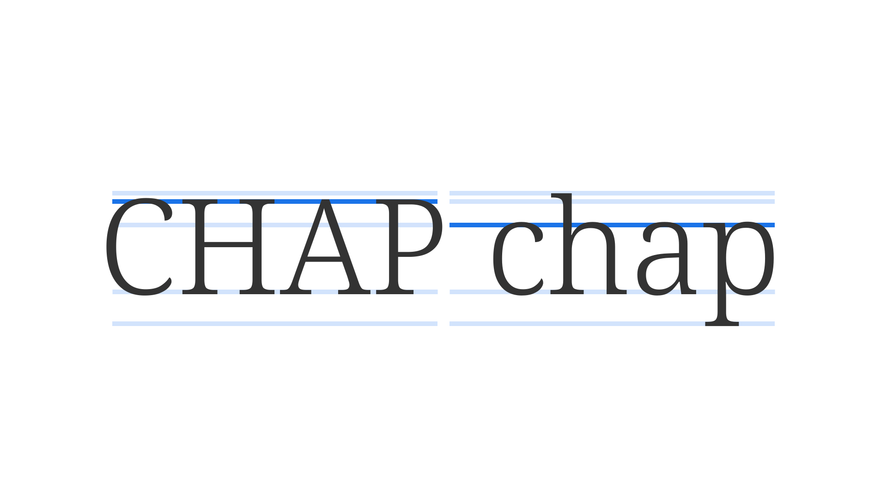

Writing systems that use uppercase and lowercase sets have characters with equivalents in each set. Uppercase (or capital) letters—the larger of the two— are used for the beginning of sentences, proper nouns, and abbreviations. They can also be used for purely aesthetic purposes, such as in [display](/glossary/display) signage. Lowercase letters are used for every other scenario.

<figure>

</figure>

The original version of the [Latin alphabet](/glossary/latin) contained only uppercase forms. Lowercase letters were based on cursive handwritten forms.

When spacing uppercase [text](/glossary/text_copy), especially at small sizes, it’s usually beneficial to aid [readability](/glossary/legibility_readability) by applying more open [tracking (letter-spacing)](/glossary/tracking_letter_spacing). To transform between uppercase and lowercase, many applications and word processors have built-in options; in CSS, it’s achieved using `text-transform`.
