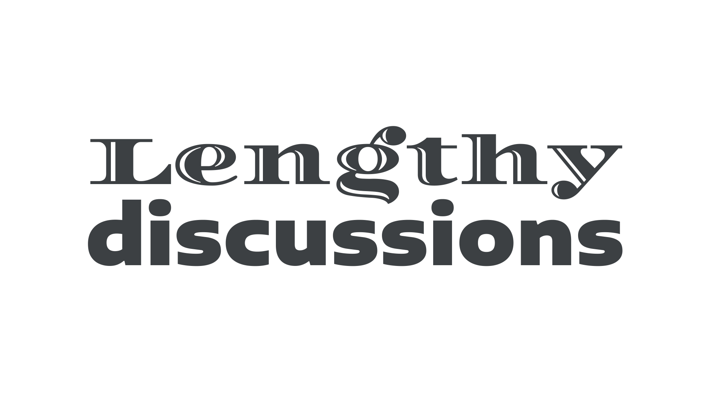

Wide or extended [typefaces](/glossary/typeface) are those with characters that typically take up a great deal of horizontal space, sitting at the opposite end of the spectrum from [“condensed” or “compressed”](/glossary/condensed_narrow_compressed) [type](/glossary/type).

<figure>

</figure>

These broader faces are not merely extended—they’re redrawn so that the proportions and angles are reshaped relative to the original design, without causing distortion to the [letterforms](/glossary/letterform) (in contrast to type that is [artificially widened by software](/glossary/faux_fake_pseudo_synthesized)).
