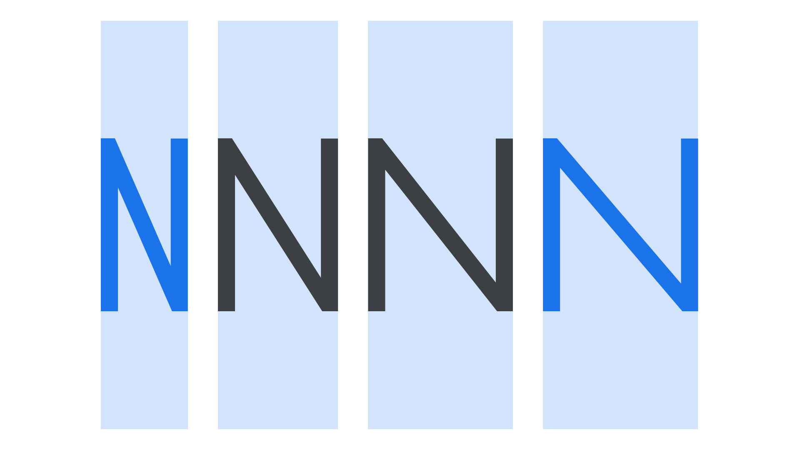

Width is the result of how much horizontal space is taken up by a [typeface](/glossary/typeface)’s [characters](/glossary/character). A [condensed](/glossary/condensed_narrow_compressed) face takes up considerably less space than a [wide](/glossary/wide_extended) one.

<figure>

</figure>

Although different widths of a single typeface family have traditionally been separated out into individual [font](/glossary/font) files, [variable fonts](/glossary/variable_fonts) allow [foundries](/glossary/type_foundry) to distribute all widths in one unified file. Variable fonts also give freedom to the end user (the designer) to use bespoke widths in between the pre-defined [instances](/glossary/instance) by adjusting a variable font’s width [axis](/glossary/axis_in_variable_fonts).

It’s also worth noting that in the majority of typefaces, a font’s [weight](/glossary/weight) affects its width: A bold style normally takes up more horizontal space than a regular style. The exception to this rule is a [multiplexed](/glossary/multiplexed_duplexed_uniwidth) design.
