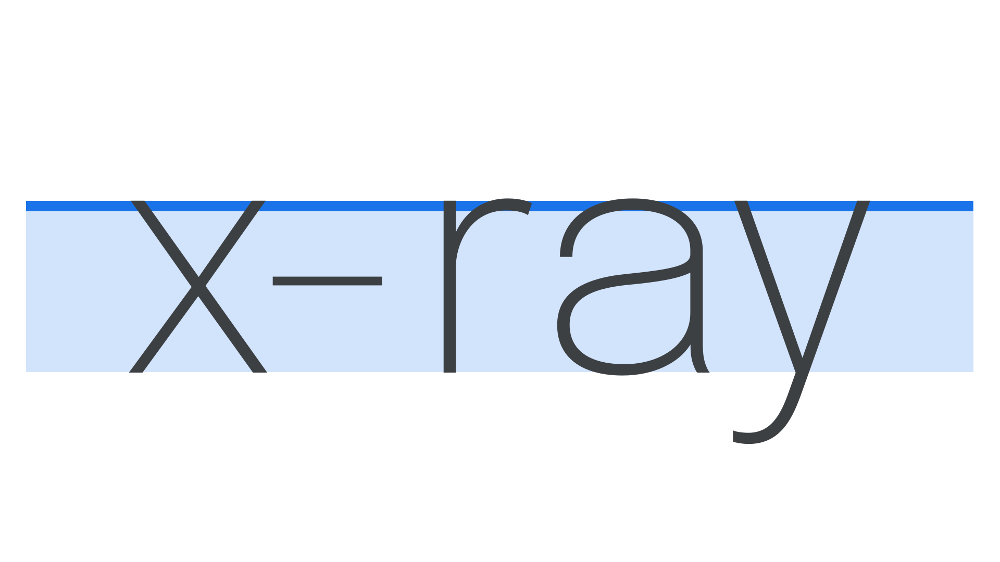

Although it’s based upon the height of the lowercase “x” [glyph](/glossary/glyph) in a [typeface](/glossary/typeface), x-height also considers the height of the [lowercase](/glossary/uppercase_lowercase) [characters](/glossary/characters) that have no [ascenders](/glossary/ascenders_descenders) nor [descenders](/glossary/ascenders_descenders); this indicates how tall or short the type appears in typical lowercase or mixed-case settings.

Generally, conversations around x-height are about [legibility](/glossary/legibility_readability), because a typeface with a small x-height has longer ascenders and descenders.

<figure>

</figure>

The x-height itself is measured from the type’s [baseline](/glossary/baseline) to the height of lowercase glyphs, not including any ascender or overshoot. Because many glyphs have overshoots or rounded tops, the top of flat glyphs such as x, y, and z are easier to measure—hence “x-height.”
