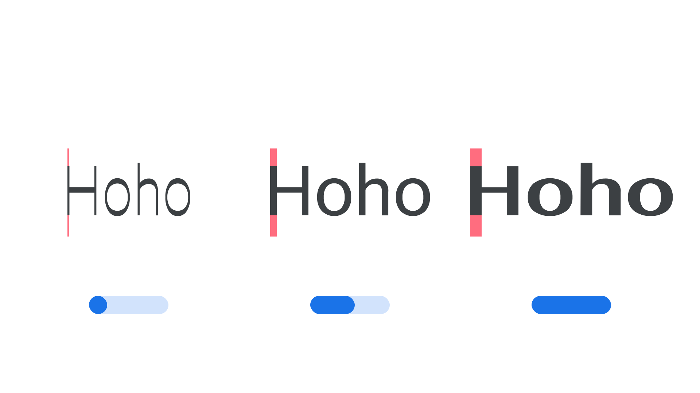

“Parametric Thick Strokes” (`XOPQ` in CSS) is a parametric axis, found in some variable fonts, for specifying and varying thick stroke weights, such as stems.

The [Google Fonts CSS v2 API ](https://developers.google.com/fonts/docs/css2) defines the axis as:

| Default: | Min: | Max: | Step: |
| --- | --- | --- | --- |
| 88 | -1000 | 2000 | 0 |

<figure>

</figure>

Its four-letter abbreviation, XOPQ, is a reference to its logical name, “X Opaque”, which describes how it alters the opaque stroke forms of glyphs typically in the X dimension, such as the weight of the thicker vertical stems in an “H.” However, often the thick strokes are not perfectly aligned to the cartesian grid, such as in the letter “X” or “O” when there is an angle of stress. It’s logically related to both the other opaque axis, Y Opaque (YOPQ), which offers parametric control of thin strokes, and the other X dimension axis, X Transparent (XTRA), which controls the widths of counters.

In line with the current CSS spec, the four-character code for this axis should be referenced in UPPERCASE (only the five axes registered in the OpenType format specification should appear in lowercase). Also, when using the Google Fonts API, the uppercase axes have to appear first in the URL.
