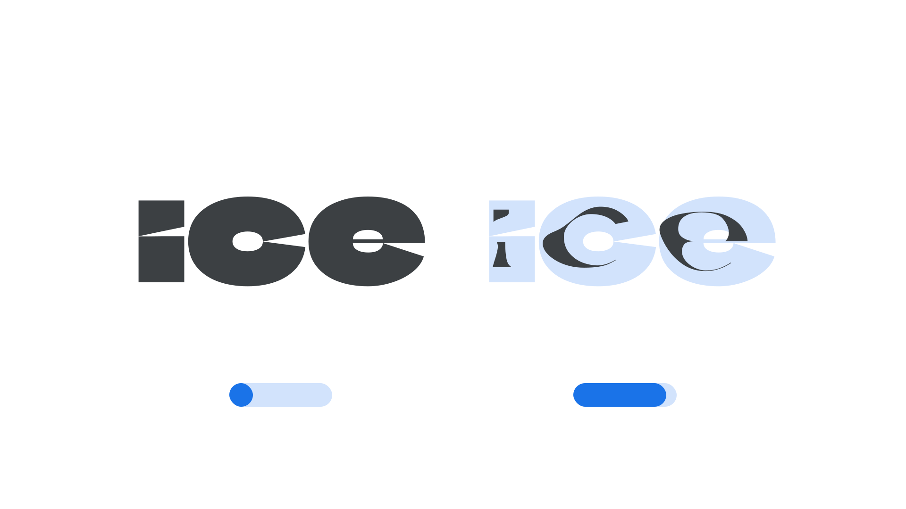

“Year” (`YEAR` in CSS) is an [axis](/glossary/axis_in_variable_fonts) found in some [variable fonts](/glossary/variable_fonts) that can be used to show the effect of time — metaphorically — on the type used to set the text.

The [Google Fonts CSS v2 API](https://developers.google.com/fonts/docs/css2) defines the axis as:

| Default: | Min: | Max: | Step: |
| --- | --- | --- | --- |
| 2000 | -4000 | 4000 | 1 |

<figure>

<figcaption>The [Climate Crisis font](https://fonts.google.com/specimen/Climate+Crisis) has a ‘Year’ axis that starts in 1979 with fully formed letters and progresses to 2050 where the letters appear melted away to the point that they are almost illegible.</figcaption>
</figure>

The axis’ first use, in the Climate Crisis font created by Finnish newspaper Helsingin Sanomat, shows how Arctic ice has and will continue to shrink because of climate change, based on current forecasts. It was informed by the US National Snow and Ice Data Center’s Arctic sea ice data from 1979 to 2019, plus the Intergovernmental Panel on Climate Change’s predictions for Arctic sea ice all the way to 2050. 

The design of the [letterforms](/glossary/letterform) change as the axis is manipulated to appear visually similar to melting ice. The number system of the axis uses years as units, so it can be used for many different kinds of historical progressions. Currently it’s defined in the Google Fonts Axis Registry as ranging from the year 4,000 BCE to 4,000 CE.