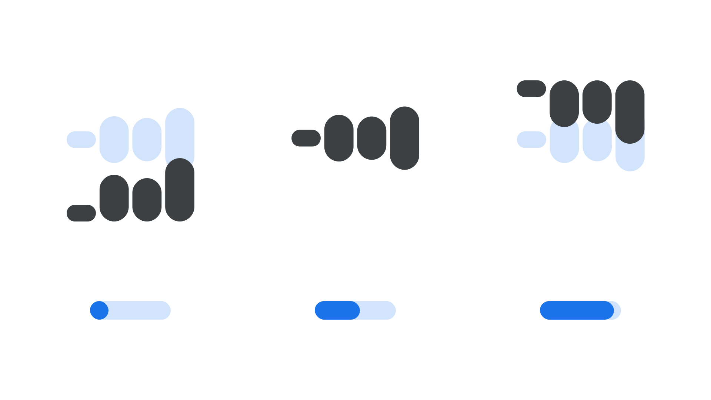

“Vertical Element Alignment” (`YELA` in CSS) is an [axis](/glossary/axis_in_variable_fonts) found in some [variable fonts](/glossary/variable_fonts) that can be used to align elements within modular typefaces’ glyphs to different positions in the Y dimension.

The [Google Fonts CSS v2 API](https://developers.google.com/fonts/docs/css2) defines the axis as:

| Default: | Min: | Max: | Step: |
| --- | --- | --- | --- |
| 0 | -100 | 100 | 1 |

<figure>

<figcaption>In the <a href="https://fonts.google.com/specimen/Wavefont">Wavefont</a> typeface, 3 sets of 4 vertical stroke elements with varying lengths are shown aligned to the bottom of the em, symmetrically center-aligned, and aligned to the top of the em.</figcaption>
</figure>

The number system is a percentage and can be understood on a relative basis: The default value is zero, which center-aligns the letterforms; the minimum value of -100% aligns them to the bottom of the em square; the maximum value of 100% aligns them to the top of the em square. 

This axis was first introduced in the [Wavefont](https://fonts.google.com/specimen/Wavefont) typeface.