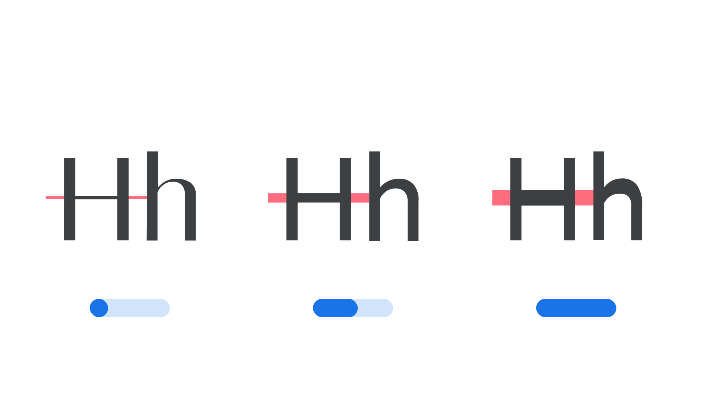

“Parametric Thin Stroke” (`YOPQ` in CSS) is a [parametric axis](/glossary/parametric_axis), found in some [variable fonts](/glossary/variable_fonts), for specifying and varying thin [stroke](/glossary/stroke) weights, such as bars and hairlines.

The [Google Fonts CSS v2 API](https://developers.google.com/fonts/docs/css2) defines the axis as:

| Default: | Min: | Max: | Step: |
| --- | --- | --- | --- |
| 116 | -1000 | 2000 | 0 |

<figure>

</figure>

Its four-letter abbreviation, `YOPQ`, is a reference to its logical name, “Y Opaque”, which describes how it alters the opaque stroke forms of glyphs typically in the Y dimension, such as the weight of the thinner horizontal bar in an “H”. It’s logically related to the Parametric Thin Stroke axis (`XOPQ`) as that controls the stroke weights at other (usually perpendicular) areas of each glyph, and other Y dimension axes, such as the [Parametric Lowercase Height axis (YTLC)](/glossary/ytlc_axis).

In line with the current CSS spec, the four-character code for this axis should be referenced in UPPERCASE (as only the five axes registered in the OpenType format specification should appear in lowercase). Also, when using the Google Fonts API, the lowercase axes have to appear first in the URL, followed by the uppercase, each in alphabetical order.
