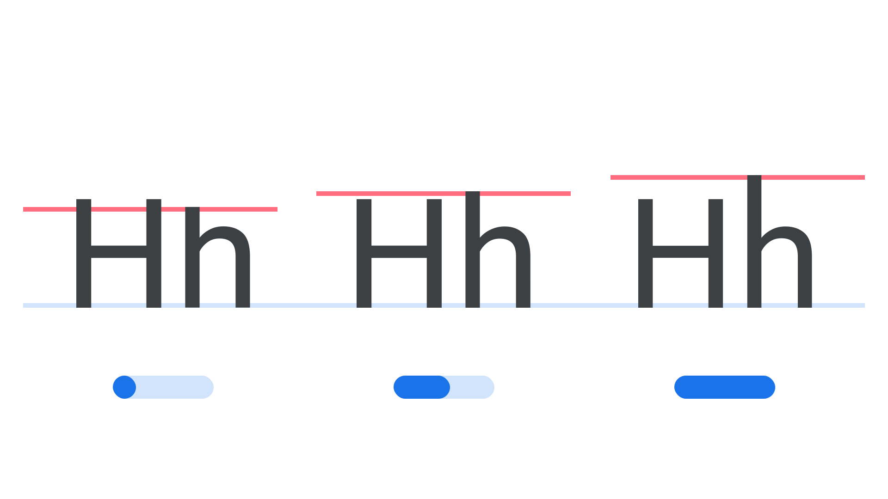

“Parametric Ascender Height” (YTAS in CSS) is a parametric axis, found in some variable fonts, for specifying and varying the height of lowercase ascenders.

The [Google Fonts CSS v2 API ](https://developers.google.com/fonts/docs/css2) defines the axis as:

| Default: | Min: | Max: | Step: |
| --- | --- | --- | --- |
| 750 | 0 | 1000 | 0 |

<figure>

</figure>

The four-letter abbreviation, YTAS, is an acronym for its logical name, “Y-Transparency for Ascenders.” It may be used in conjunction with other axes controlling Y-Transparencies (vertical alignment zones), especially the Parametric Uppercase Height axis (YTUC) and Parametric Descender Depth axis (YTDE).

In line with the current CSS spec, the four-character code for this axis should be referenced in UPPERCASE (only the five axes registered in the OpenType format specification should appear in lowercase). Also, when using the Google Fonts API, the uppercase axes have to appear first in the URL.
