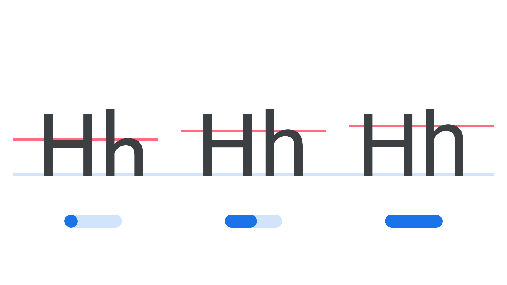

“Parametric Lowercase Height” (`YTLC` in CSS) is a [parametric axis](/glossary/parametric_axis), found in some [variable fonts](/glossary/variable_fonts), for specifying and varying the height of counters and other spaces between the [baseline](/glossary/baseline) and [x-height](/glossary/x_height).

The [Google Fonts CSS v2 API ](https://developers.google.com/fonts/docs/css2) defines the axis as:

| Default: | Min: | Max: | Step: |
| --- | --- | --- | --- |
| 500 | 0 | 1000 | 0 |

<figure>

</figure>

It’s important to recognize that this axis does not control the x-height proportions of the [typeface](/glossary/typeface), but only the vertical space in lowercase letters; to adjust the x-height, it’s better to adjust several settings in concert, such as [parametric cap height](/glossary/ytuc_axis), [parametric ascender height](/glossary/ytas_axis), [parametric descender depth](/glossary/ytde_axis), and [parametric figure height](/glossary/ytfi_axis).

Its four-letter abbreviation, YTLC, is a reference to its logical name, “Y-Transparency for Lower Case.” It may be used in conjunction with other axes controlling X- and Y-transparencies (parametric counters and vertical alignment zones).

In line with the current CSS spec, the four-character code for this axis should be referenced in UPPERCASE (as only the five axes registered in the OpenType format specification should appear in lowercase). Also, when using the Google Fonts API, the lowercase axes have to appear first in the URL, followed by the uppercase, each in alphabetical order.
