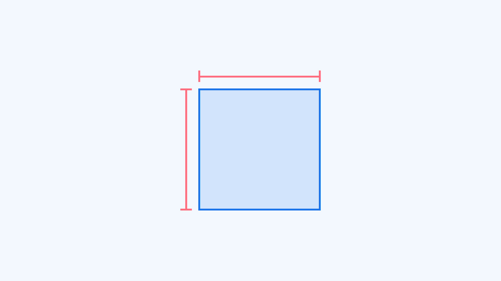
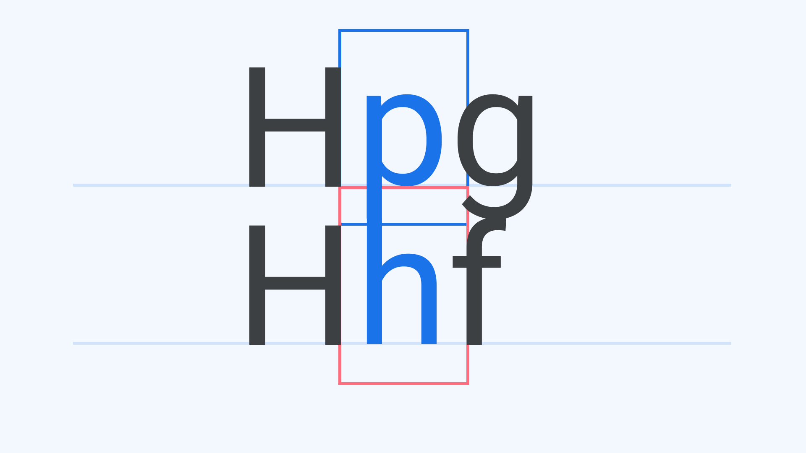
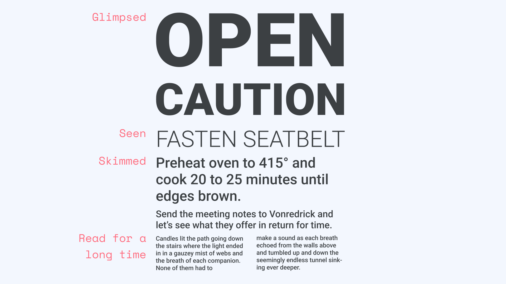
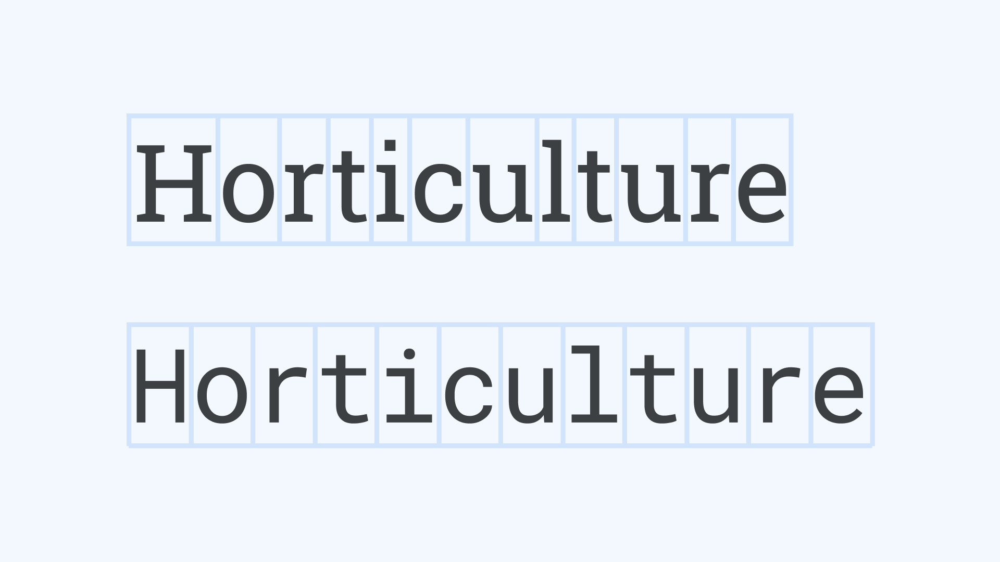
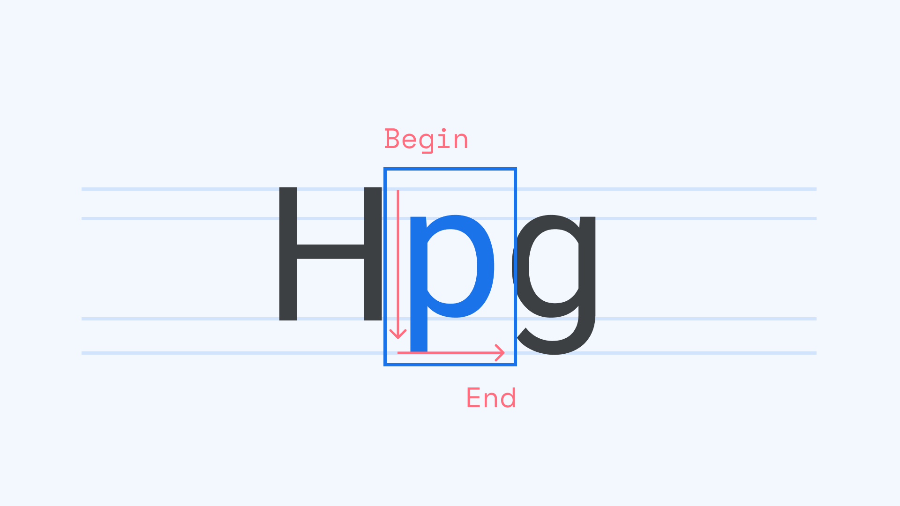
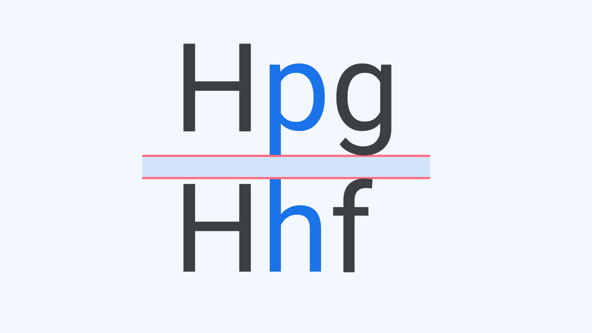
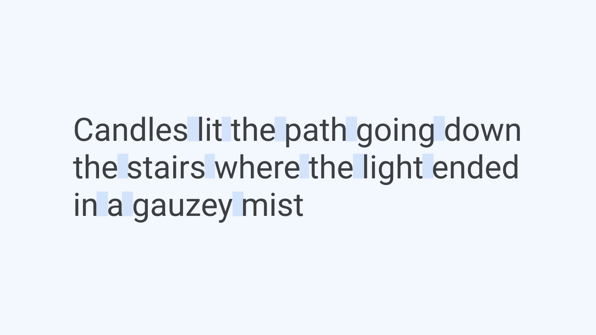
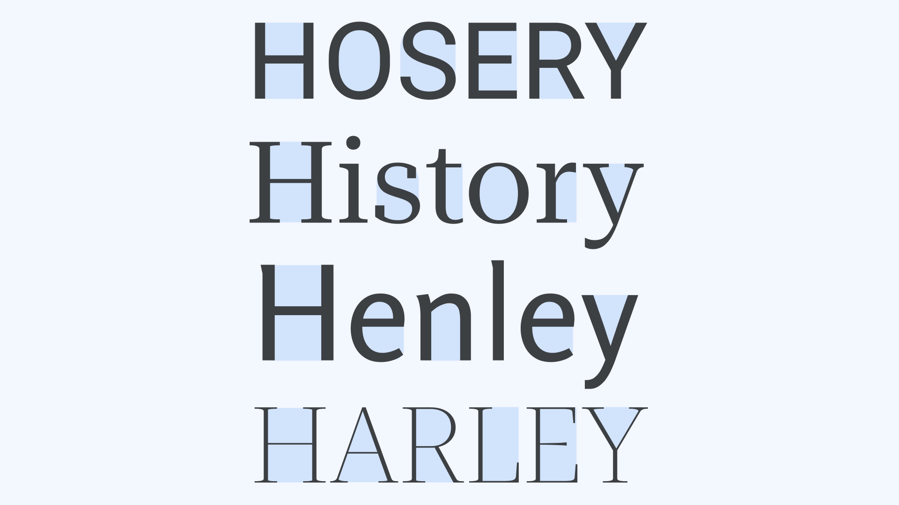
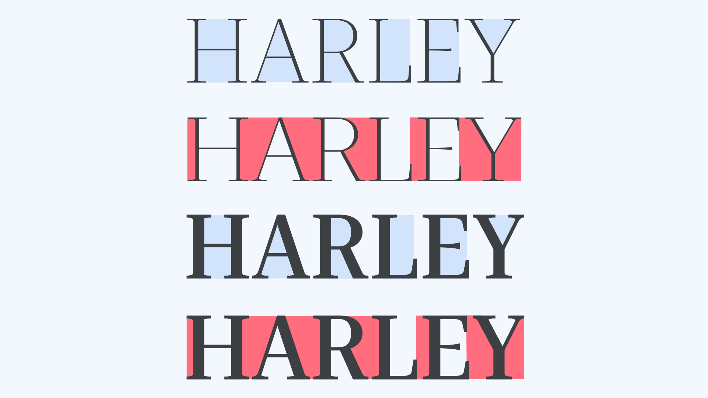

[Type](/glossary/type) is, in essence, a series of shapes, in various combinations, hanging onto a framework of rectangles. [Typography](/glossary/typography) can contain a lot of different elements, beyond text and space, like symbols, icons, rules, ornaments, and effects. But for the most part, it contains just the marks of [glyphs](/glossary/glyph) and the spaces within and around them. And the majority of the fonts we use today contain mostly space.

So let’s take a closer look at the  roles of these spaces, the interplay of their roles, and how some of their roles change with the addition of [variable fonts](/glossary/variable_fonts).

## The em square

Typography starts with the “imaginary” [em square](/glossary/em).

This is a rectangle of equal sides and angles, making it a square:

<figure>

<figcaption>The em square</figcaption>

</figure>

In type, this square represents to the type designer two things that are important links to the reader:

One: Vertically, the space represents where the vertical intersection is between lines of text when the font is composed at any size, without additional vertical space.

<figure>

<figcaption>The vertical dimensions of a font’s main glyph groups.</figcaption>

</figure>

So the [type designer](/glossary/type_designer) plans the vertical metrics of all the [characters](/glossary/character) of a [typeface](/glossary/typeface), based on how the designer wants collections of characters, words usually, to be glimpsed, seen, viewed, skimmed, read, or read for a long time.

<figure>

<figcaption>Length of text/various ways to see it. </figcaption>

</figure>

Two: Horizontally, the measure of the height is where “em square” comes from, though when the font of a script and design are proportionally spaced (as in many [Latin scripts](/glossary/latin)), the horizontal dimension of each glyph represents the default spacing of each character. This allows them the best spacing solution in consideration with all the other characters in the font. (So far, this is true of all scripts, and all designs.)

<figure>

<figcaption>Glyphs of different widths. Monospaced all one width.</figcaption>

</figure>

Add to all this the direction of reading (at the behest of whichever direction, or directions, a language allows), and the square has direction. For example—and to zero in on one script at a time—Latin is read in lines from top to bottom, with each line being read from left to right. So the square has a beginning on the top and left sides, and has ends at the bottom and the right side.

<figure>

<figcaption>Beginnings and ends of transparencies.</figcaption>

</figure>

The em square (called an em quad in metal type), can be seen typographically as a space with beginnings and ends, and nothing in the midst of that, at the size of the type with no additional spacing around it. The other spaces affect the appearance of our square, if between the lines is not zero, and/or between the letters isn’t zero.

<figure>

<figcaption>Em square with/without additional line spacing and letter spacing..</figcaption>

</figure>

Between the lines is called line spacing and is valued either by the size of the space or as a percentage of the size of the type. Between the letters are default letter spacing and kerning, with tracking being a function for changes to both, also usually expressed as a percentage of size.

## The Word Space

The largest key on most keyboards, and the most important character to spacing in a font, is the space—or word space. In Latin typefaces, its width is derived from a formula, or simply chosen visually by the type designer. It is often adjusted by applications, but its fundamental job is to make certain it’s the largest horizontal space in any given piece of text of a single size.

<figure>

<figcaption>Word space and its adjustment.</figcaption>

</figure>

Its second most critical task is to remain around the same as, or smaller than, the line space, i.e.; the space between lines. Obviously the word space is less important than (and sometimes absent entirely from) type that’s glimpsed, seen, or viewed, but is increasingly important if the text is to be skimmed, read, or read for a long time.

The type designer’s task, then, is to create a default word space and default letter spacing that work. And then it’s the often long and arduous task of making kerning pairs: a list of exceptions to the default letter spacing that need to be prevented from touching, like /f/? (which we’ll get to later), or competing with the size of the word space, like /T/o (which we’ve gotten through now).

<figure>

<figcaption>Default letter spacing and Kerning vs word space.</figcaption>

</figure>

## The Counter

There’s only one other kind of space left in type and it’s inside the letters. [Counters](/glossary/counter) may be fully enclosed, like the interior of “o,” trapped along the [baseline](/glossary/baseline) and [cap height](/glossary/cap_height), like “K,” or swirling amidst the stem of the “S,” but it’s what gives a typeface the start on all the other spaces we’ve covered.

<figure>

<figcaption>Counters.</figcaption>

</figure>

The user has three kinds of control over this space: Type size, applied to a single style of type, makes them grow and shrink linearly(?) to the change of size; changing to the use of different styles within a regular font [family](/glossary/family_or_type_family_or_font_family) alters the internal white spaces according to the style change from one to the next; variable fonts technology, which can provide both of the above, can also provide [optical sizes](/glossary/optical_sizes) that adjust the internal white spaces over a range of sizes, as well as add fluid ranges of weight and width axes.

<figure>

<figcaption>Counter changes via size, style and opsz.</figcaption>

</figure>

And while typefaces overwhelmingly end with well-defined spaces between words, letters and exceptional pairs; and many typeface families include a blizzard of styles, each with unique spacing; the way font software, applications, and web browsers operate makes Latin typography a challenge to the people who use the fonts. And where there is a challenge in Latin, there’s likely to be more elsewhere in the world of scripts.
