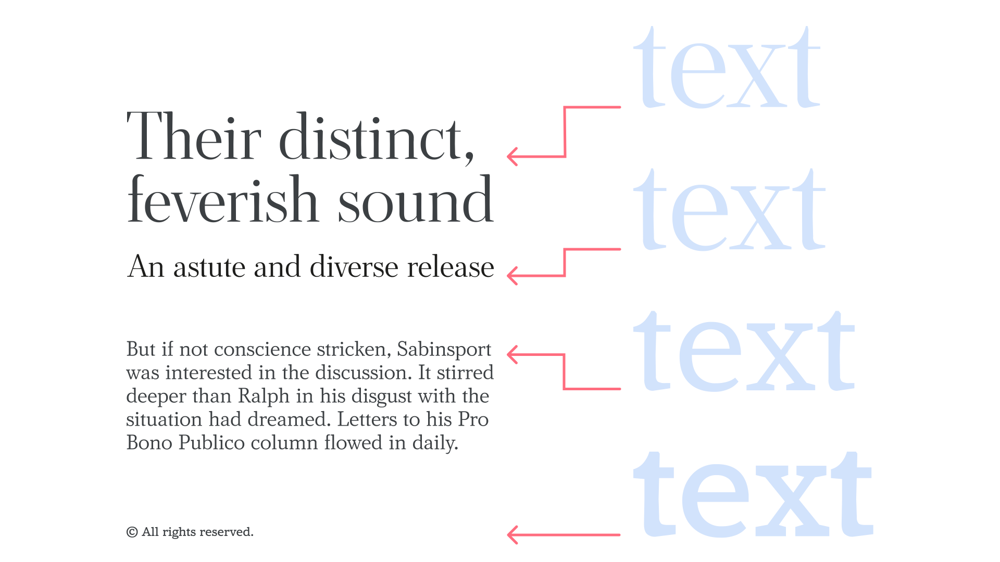
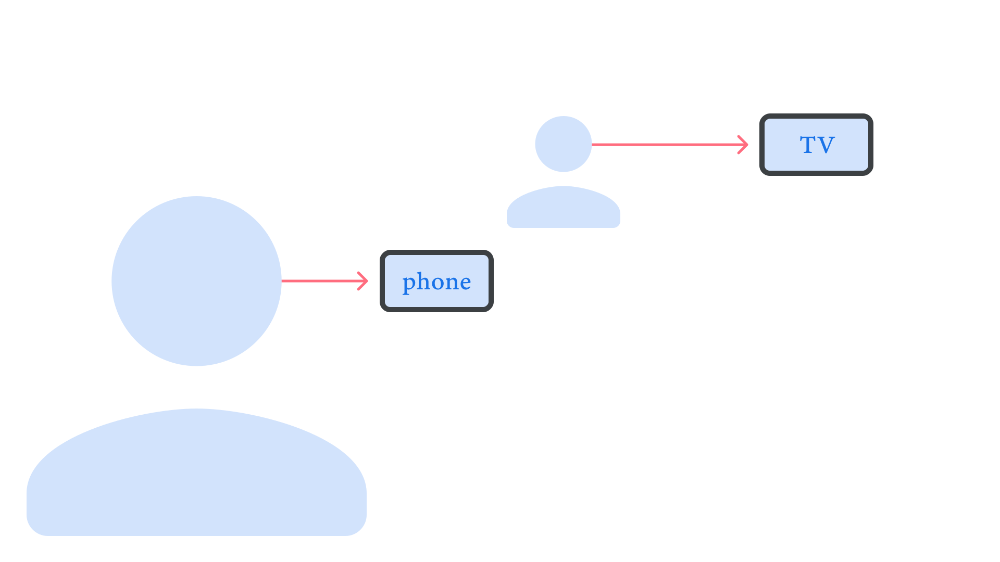

[Optical sizing](/glossary/optical_sizes) refers to the practice of [type foundries](/glossary/type_foundry) creating slightly different versions of a [typeface](/glossary/typeface) intended to be used at different sizes. Generally speaking, small ([body](/glossary/body) or caption) optical sizes tend to have less stroke [contrast](/glossary/contrast), larger [x-heights](/glossary/x_height), wider [characters](/glossary/character), and more open spacing. Their large (or [display](/glossary/display)) counterparts have refined features and tighter spacing—characteristics that would hinder their readability at small sizes.

On the web, there is a file-size cost for using each addition axis in a variable font. Generally, any time you add an Optical Size axis, the font file-size will typically double, but this depends on the family and the other axes used – it can range between 1.2× and 2.6×. 

<figure>

<figcaption>On the left, text set in four different optical sizes—display, subhead, body, and caption—at the intended font sizes for each. On the right, all set at the same font size.</figcaption>

</figure>

The practice of optical sizing is not new; in fact, creating slight variations in glyphs for different sizes was a natural by-product of making metal and wood type. In their introduction to the concept on [the website for their book, “Size-Specific Adjustments to Type Designs,”](https://justanotherfoundry.com/size-specific-adjustments-to-type-designs) Shoko Mugikura and Tim Ahrens say:

> “Op­tical sizes” [...] were prac­ticed for 500 years of metal type print­ing. Since punches had to be cut separ­ately for each type size, adjust­ing them accordingly did not involve any addi­tional effort and the optical compens­a­tions were built into the fonts.

Phototypesetting and early digital type ignored optical sizing for expediency. As type could be enlarged and reduced at will thanks to the new technologies, type designers and foundries felt no need for size-specific designs, as drawing only one catch-all version lowered the production cost dramatically. However, in recent years it has enjoyed a comeback, as contemporary designers have come to appreciate the need for optical size adjustments. Captions, body type, headings, and poster sizes simply look better—and work better together—when the appropriate optical sizes are used. And, with [variable fonts](/glossary/variable_fonts), it’s possible for optical size to be a variable in itself, if so desired by the [type designer](/glossary/type_designer).

<figure>

</figure>

For the novice [typographer](/glossary/typographer), the need for different optical sizes might not be immediately apparent, but once you better understand their role, this is a technical consideration that can have a very strong influence on your choice of typeface or [type family](/glossary/family_or_type_family_or_font_family).

Regardless of media, if we’re creating a brand that will require text to be set very small and also very large, optical sizes will undoubtedly be useful. The small body type can focus on enhanced legibility; the large display type can show off the intricacies of the letterforms; both will sit better alongside each other.

<figure>

</figure>

And it’s not just relevant for those of us creating large-scale graphics, either. Consider the humble television set: If we’re designing something to appear primarily on TVs, we could easily be forgiven for thinking that we have a large viewport to work with—and therefore can afford to use our type’s “display” version, which is optimized for rendering at huge sizes. But hang on: While the average TV might indeed be quite large, its position in the average sitting room relative to the person watching the TV means its perceived size is more like a mobile device.

<figure>

</figure>

With this in mind, it’s generally more appropriate to design for TVs as you would for mobile and use a body optical size for your type (i.e., one with lower contrast and more generous spacing). And, although mobile phones and TVs are constantly improving their resolution and pixel density, we can never assume that all of our users will have access to the higher-quality screens, or that their vision will be unimpaired.

When designing for film (and TV), we also have a huge range of screen sizes to consider: from the massive, such as movie theaters, to the tiny, such as low-resolution, in-seat airplane screens. Employing optical sizes, if available, will lead to a better reading experience in these different scenarios.
