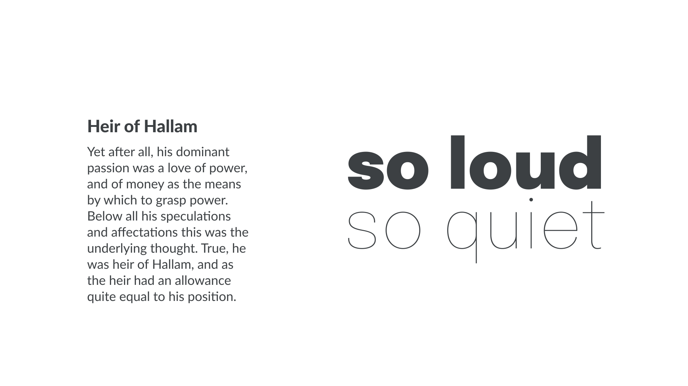
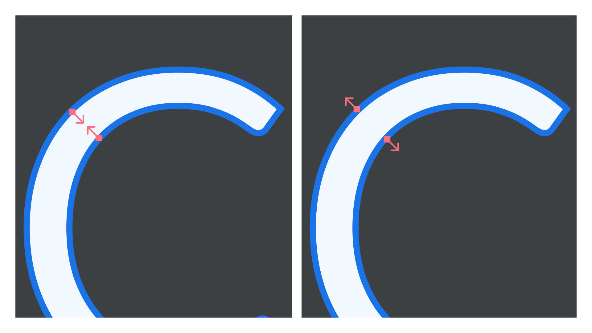
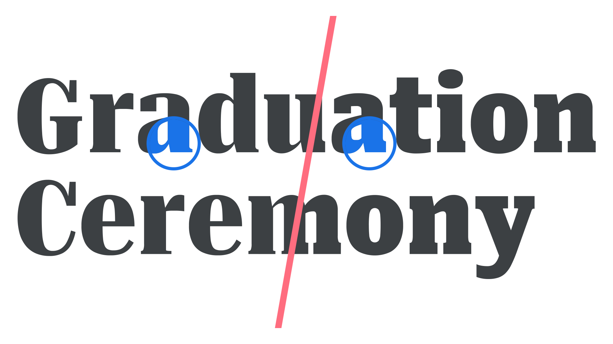

With most [typefaces](/glossary/typeface) offering [regular](/glossary/regular_upright), [bold](/glossary/bold), [italic](/glossary/italic), and bold italic [weights](/glossary/weight) and [styles](/glossary/style), it’s reasonable to ask why we might need yet more variation. Those four—as we’ve covered in [our introduction to weights and styles](/lesson/introducing_weights_styles)—are usually enough to convey the required emphasis and hierarchy, especially when paired with other typographic elements, such as changes in [font](/glossary/font) size.

However, there are in fact many scenarios where multiple weights—if not multiple styles—are not just desired, but *essential.*

## Using weights for hierarchy, emphasis, and contrast

The first and most obvious reason to switch to a different weight is to introduce contrast to a piece of text. This contrast can imply hierarchy, such as a heavier weight for headings; it can show emphasis, with bold type used to highlight particular words or sentences; or it can simply create visual interest, to catch the eye and stop the reader from getting bored as they read the text—a useful trick to employ for posters, magazine covers, or social media materials.

And while hierarchy, emphasis, and contrast can each be achieved with the basic regular and bold weights, far more freedom is afforded to us if we can employ more extreme differentiations, such as moving from a hairline to a black weight.

<figure>

</figure>

When using weight for emphasis, we must ensure that the weights are different enough from each other. Avoid using semibold for emphasis in regular text. Use bold or extrabold to ensure a clearly visible difference.

## Using weights—or grades—for readability

When working on screen, light type on a dark background appears to glare and its letterforms become bloated. This is a concept known as “halation”, which also presents itself in illuminated signage at night. As such, multiple studies have been conducted on [legibility](/glossary/legibility_readability) for roadsigns (see the NHTSA’s [“Nighttime Glare and Driving Performance” report](https://www.cortezlawfirmpllc.com/wp-content/uploads/sites/1600711/2020/05/glare_congressional_report.pdf) and [“Overhead Guide Sign Retroreflectivity and Illumination” from the Kansas State University Transportation Center](https://rosap.ntl.bts.gov/view/dot/28555)).

If we want to mix light-on-dark type with dark-on-light type, we need to counter this halation problem with a little optical trickery: by selecting different weights so that both versions of the type *feel* the same.

In the illustration below, the type on the left uses the Regular weight of Lato, while the type on the right uses the Semibold weight—and yet, optically, they appear the same.

<figure>

</figure>

When working in print, we have the opposite problem. If, for instance, we’re designing packaging that uses large areas of flat color, then any white type we set on a colored background will use the color of the paper; i.e., the area where no ink is placed. Therefore, the ink around that white type may bleed *into* the [letterforms](/glossary/letterform)—and thus render them too thin. And that means using a heavier weight to visually balance the type. Unfortunately, because we’re looking at these examples on screen, it’s almost impossible to illustrate this accurately, but here’s an exaggerated approximation:

<figure>

</figure>

However, the less common type property known as grade is even more useful than weight in these scenarios. Weight usually has an effect on width as well, while grade alters only the thickness of the [stroke](/glossary/stroke) without changing the width of the [glyph](/glossary/glyph).

Although grade can alter [contrast](/glossary/contrast), it differs from [optical sizing](/glossary/optical_sizes) because its purpose is to compensate for degradations in appearance and bring it back towards the intended design.

<figure>

</figure>

Grade was originally created for printed newspapers, when low-quality printing techniques and cheap paper might render type illegible when using the non-graded fonts. But it’s equally useful when mixing different types of paper: Think of a newspaper (lower quality paper, more bleed) that also has a magazine-style weekend supplement (higher quality paper, less bleed). This is a perfect use case for using different grades to achieve identical typographic color for the [body](/glossary/body) text in both instances.

This level of granular control by us [typographers](/glossary/typographer) to create the optimal reading experience is enabled further still by the use of [variable fonts](/glossary/variable_fonts): Rather than choose between predefined weight or grade values, we can choose exactly how much thicker or thinner our type’s strokes need to be, or how much contrast can be used, in order to counter any negative effect. There’s no need to jump from bold to extra bold, for instance, when we can select a value on the sliding scale that sits between those two weights. Similarly, we don’t need to choose between grade -50 or grade +200, when we can select a value such as 128.
