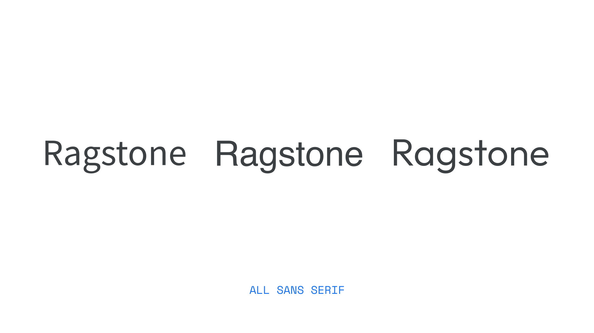
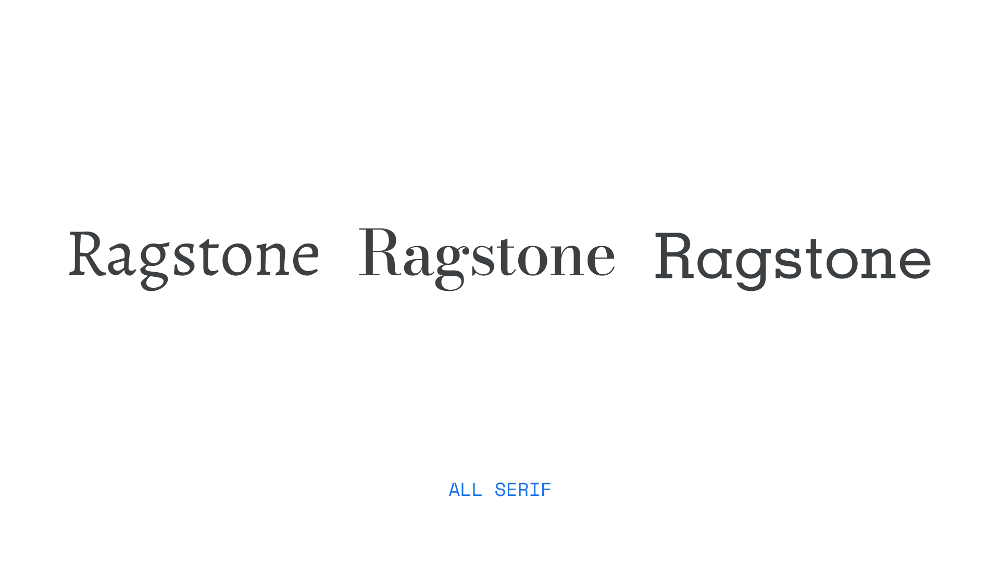
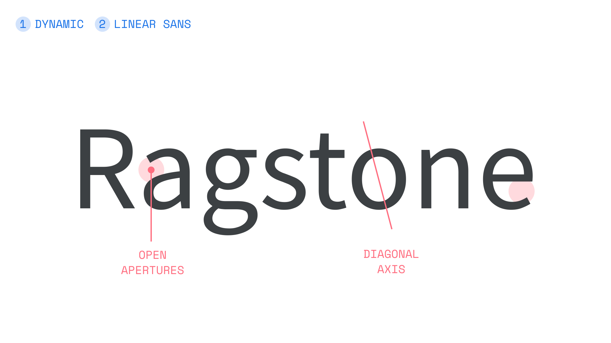
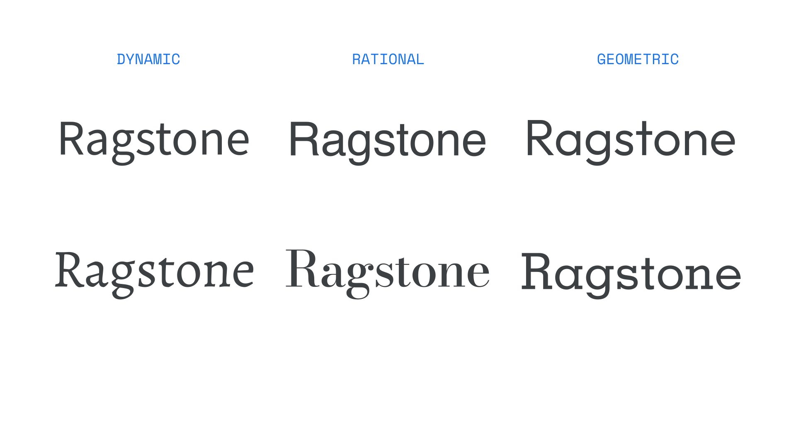
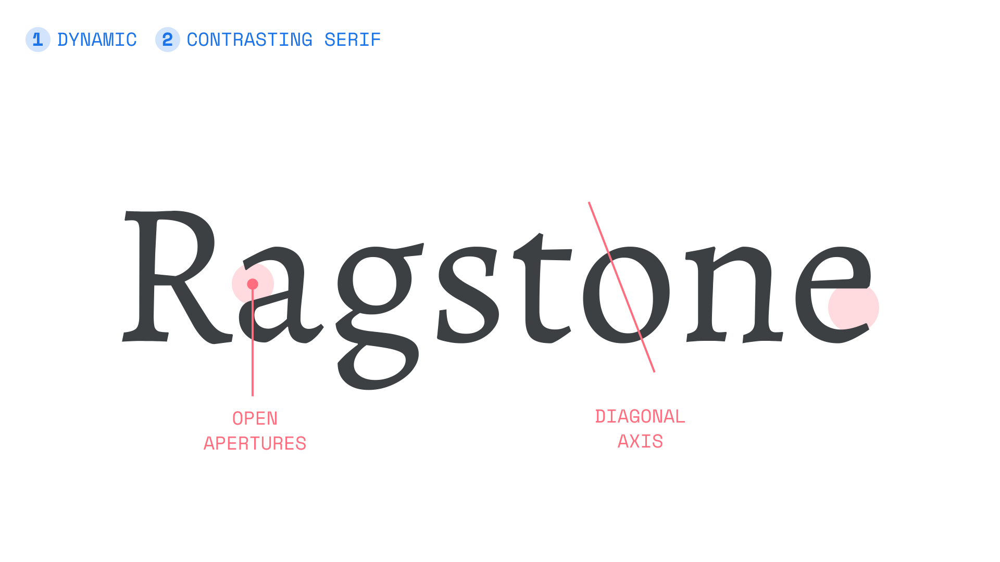
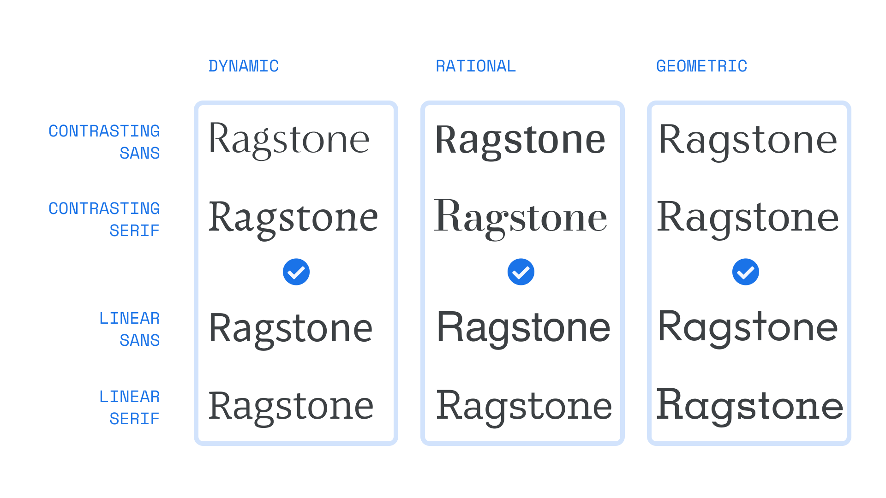
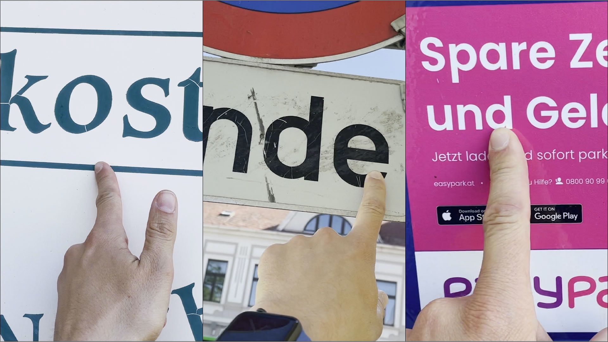
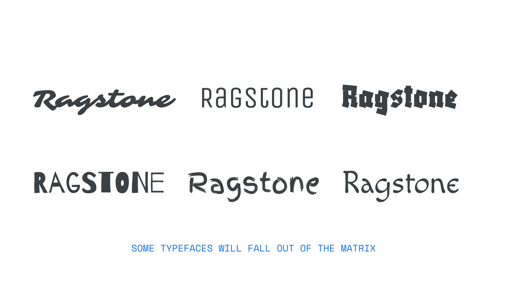

The single biggest challenge we face when [pairing type](/topic/pairing_type) is choosing a secondary [typeface](/glossary/typeface) that’s different enough from our primary choice, but not _too_ different, as described in our article “[Pairing typefaces](/lesson/pairing_typefaces)." This can be a challenge, because it’s not always clear where the similarities and the differences should lie.

In this article, we want to share with you the concept of the font matrix—an approach based on the work of typography professor [Indra Kupferschmid](https://de.wikipedia.org/wiki/Indra_Kupferschmid). Understanding it can change your perception of type and give you a framework to make better decisions when pairing typefaces.

Please bear in mind that combining type is not a science with hard and fast rules. It’s a creative discipline and you can do whatever you think feels right for your project. Take the ideas shared in this article as guidelines to make your own decisions in the great adventure of pairing type.

## The problem with the current models for classifying type

Before we dive into this different way of describing type, let’s see what’s not ideal with the current models. Organizing typefaces is important to make it easier to narrow down our selections. Simple [genre classifications](/lesson/making_sense_of_typographic_classifications), like [serif](/glossary/serif), or [sans serif](/glossary/sans_serif), are a good starting point. But they still leave you with a lot of typefaces to choose from.

<figure>

</figure>
<figcaption>These are all sans serif typefaces (Source Sans Pro, Helvetica, Outfit). Same genre, but they leave a quite different impression.</figcaption>

<figure>

</figure>
<figcaption>These serif typefaces share the same genre classification as well, and still they appear quite diverse (Alegreya, Bodoni Moda, Memphis).</figcaption>

On the other hand, [historical classifications](/lesson/making_sense_of_typographic_classifications) can be more fine-grained, but require a little background knowledge. They can be confusing in their terminology and have plenty of regional variations. Focusing on details, such as the exact shape of serifs, which are not necessarily crucial to the overall impression of a typeface, makes them less practical. In fact, the historic approach can become less useful in an age where type designs mix influences from various periods of time.

So how can we describe typefaces more accurately than with the genre classifications, but without being dependent on historic background knowledge? Kupferschmid approaches it with a three-layer system:

* Layer 1: Skeleton (form model)
* Layer 2: Flesh (contrast & serifs)
* Layer 3: Skin (finer differentiation)

<figure>

</figure>
<figcaption>A three-layer approach for describing typefaces based upon the work of Indra Kupferschmid.</figcaption>

Let’s take a look at each individual layer to understand what it means and how it can help us choose and pair typefaces.

## Layer 1: Skeleton (form model)

This is the most crucial part: referring to the structure underneath a typeface. There are three basic form models:

* Dynamic
* Rational
* Geometric

Dynamic forms show open apertures, while the rational form model has closed apertures. The geometric form model is represented with constructed letter shapes. These shapes can be explained by different writing tools, but we won’t focus on that here.

<figure>

</figure>
<figcaption>The three different form models shown with serif typefaces.</figcaption>

It’s easier to distinguish the form models with [contrast](/glossary/contrast) in serif typefaces. But you can still see them in sans serif shapes, too:

<figure>

</figure>
<figcaption>The three different form models shown with sans serif typefaces.</figcaption>

Let’s take a closer look at each form model and make it more obvious by setting a word. We’ll use the word “Ragstone” because it contains various letter shapes:

<figure>

</figure>
<figcaption>The dynamic form model comes with open apertures of the “e,” “a,” and “s,” as well as the diagonally angled “o” (hard to see in sans serif, set in Source Sans Pro).</figcaption>

Looking at the **dynamic form model,** you can see the open shapes, and a very subtle [diagonal axis](/glossary/axis_in_type_design). This all adds to the friendly, open, and approachable feeling that a dynamic typeface creates. [Kupferschmid associated the form models with certain adjectives](https://kupferschrift.de/cms/2012/03/on-classifications/). They can be helpful when picking a typeface that should follow a certain mood. Naturally, this mood might shift when there are serifs or no serifs, or other stylistic features, but it’s a good starting point.

<figure>

</figure>
<figcaption>The shapes of the “e,” “a,” and “s” are rather closed, and the “o” shows vertical axis (again, not very obvious in sans serif), set in Helvetica.</figcaption>

With a **rational** typeface, we can see that these apertures are closed, which then creates a more orderly, reserved, or serious feeling.

<figure>

</figure>
<figcaption>Very constructed letter shapes, like the circular “o” and “e.” The “t” is a simple cross (set in Outfit).</figcaption>

And with the **[geometric](/glossary/geometric) typefaces,** the apertures are not that relevant for determining the form model. Also, there is no obvious axis. It’s more about how constructed the letter shapes are. Like the circular “e,” “g,” “a,“ and “o,” or the simple “t.” This creates a clean, modern, and functional appearance.

Now, knowing about these underlying form models should make it easier for you to pinpoint the differences between the three sans serif and serif typefaces from the beginning of the article, and take you one step closer towards to differentiating type.

<figure>

</figure>
<figcaption>Knowing about the different form models makes it easier to describe and distinguish the typefaces from before.</figcaption>

## Layer 2: Flesh (contrast and serifs)

In the second layer, the flesh, we’re adding **contrast and serifs** to our descriptions. This will make the form model even clearer.

<figure>

</figure>
<figcaption>Describing Alegrya as a dynamic contrasting serif typeface.</figcaption>

Before, the **dynamic form** was shown with no contrast (linear) and sans serif. Here, contrast and serifs were added. This changes the appearance, it suddenly seems more traditional, but still the same open apertures and diagonal stress from the skeleton remains. It’s just more visible with the flesh on top.

<figure>

</figure>
<figcaption>Describing Bodoni Moda as a dynamic contrasting serif typeface.</figcaption>

The rational linear sans serif from before turns into a **rational contrasting serif.**

<figure>

</figure>
<figcaption>Describing Candida as a geometric contrasting serif typeface.</figcaption>

The geometric linear sans serif, becomes **contrasting with serif,** while still being geometric from its construction.

## Layer 3: Skin (finer details)

Kupferschmid includes finer differentiators in the top layer. The shape of the serifs, decorative features (such as stencil, inline, shadow), or genre-like descriptors that might be associated with the typeface (“western,” “horror,” “sci-fi,” etc.). Kupferschmid leaves this very open. This layer is not necessary for the font matrix, but it completes our typeface description.

<figure>

</figure>
<figcaption>Describing all three layers of the display typeface Rye. You can still see the underlying first two layers, even though the third layer is taking the most attention.</figcaption>

## Using the font matrix for pairing type

Now, when we arrange the first two layers in a grid, with the skeleton for the columns, and the flesh for the rows, the font matrix is revealed:

<figure>

</figure>
<figcaption>Typefaces used (top to bottom) Dynamic: Minerva Modern, Alegreya, Source Sans Pro, and Bitter; Rational: Arya, Bodoni Moda, Helvetica, Zilla Slab; Geometric: Tenor Sans, Candida, Outfit, Memphis.</figcaption>

Seeing the typefaces arranged in this way makes it obvious where the similarities and differences lie, and opens up three guidelines we can utilize to pair typefaces. Let’s explore each of those in turn.

### 1. Pair typefaces with similar form models

<figure>

</figure>
<figcaption>Combine typefaces according to their form model.</figcaption>

Typefaces from the same form model most likely will go together. Their construction is similar, but the layers added on top are different.

### 2. Pair typefaces with varying contrast and serifs

<figure>

</figure>
<figcaption>Go for contrast with very different skeleton and flesh (diagonal combinations).</figcaption>

Diagonal combinations create contrasting pairs. The typefaces are so different that they won’t get in the way of each other.

### 3. Avoid combinations with different form models, but the same contrast and serifs

<figure>

</figure>
<figcaption>Is it different or is it the same? Avoid combining typefaces from the same row.</figcaption>

Combining typefaces from the same row will create an irritating result. This is because they’re similar on a superficial level (the flesh), but in their form model, they’re diverse.

## Look for form models everywhere

The most crucial part of this system is recognizing the form model underneath a typeface. If it has serifs or not, or if it’s linear or contrasting, is easy to see. Make this a regular exercise, like a game, to train your eyes and perception of type. Take a look at whatever typefaces you encounter and describe their form models. Is it more dynamic, rational, or geometric?

<figure>

</figure>
<figcaption>Try to spot the form model in the wild! Left to right: dynamic, rational, and geometric.</figcaption>

## Combining typefaces step by step

When it comes to combining typefaces, this is the process we recommend, using the ideas behind the font matrix:

1. Decide on a primary typeface (for more on this subject, please see “[A checklist for choosing type](/lesson/a_checklist_for_choosing_type)”). What role has the primary typeface? Is it [body text](/glossary/text_copy), headings, or for something else?
2. Describe the first two layers of your primary typeface.
3. Decide on a role for your secondary typeface. What should it add to your primary typeface?
4. Decide if you want the same or a or contrasting form model for the secondary typeface.
5. For your secondary typeface, think of a generic classification, like serif or display, you want to try.
6. Browse a preferred font catalog, filtered by your genre, looking for the desired form model, contrast, and serifs.
7. Try out the combination in your design.

Let’s put this into practice with an example. Let’s say my primary typeface is Bitter, and its role is body text. Let’s describe the first two layers of it.

<figure>

</figure>
<figcaption>Steps 1 and 2: The primary typeface is Bitter, used for body text. It’s a dynamic linear serif typeface.</figcaption>

Now we look for a secondary typeface for inline code in the body text. Bitter does not come with a [monospaced](/glossary/monospaced) style. We want the secondary typeface to feel very similar to the primary choice, while being monospaced.

<figure>

</figure>
<figcaption>Steps 3 to 5: We look for a secondary typeface for inline code that’s dynamic, linear and monospace.</figcaption>

Let’s only browse the monospaced typefaces on Google Fonts and pick some candidates. When we take a look at our first selection and evaluate their form model, we see that Fira Sans might fit best to what we’re looking for.

<figure>

</figure>
<figcaption>Step 6: Our possible candidates and their form models.</figcaption>

Let’s see how this looks in an actual sentence. As suggested, Fira Code works best. It seamlessly integrates and meets the conditions of our brief. Space Mono might work as well, if we were looking for a contrasting pair.

<figure>

![Three times the sentence “In my opinion, font-family is the best declaration in CSS.“ set in the serif typeface Bitter. The word “font-family“ is set in three different mono space typefaces. The first line shows the rejected combination with “Space Mono” with very contrasting form models. The second line shows the rejected combination with “JetBrains Mono“, which is not different/same enough according to the form model. The third line shows the approved pairing with ”Fira Code“ which is most seamless.](images/combine-fonts-example-step-7.svg)

</figure>
<figcaption>Step 7: Evaluating our options in an actual sentence. Fira Code fits what we were looking for.</figcaption>

## Limitations of this system

This is not a perfect system. Not every typeface fits into it, and you won’t be able to apply it in every scenario. The examples in this article are slightly more extreme, and soon you will find plenty of cases that are in between the different form models or the other layers. In this case, try to describe it as “quite dynamic,” or “semi-rational,” for example.

<figure>

</figure>
<figcaption>From its form model, Roboto Slab does not meet all the criteria of an obvious rational typeface. But overall it still feels quite rational with its narrow proportions and vertical axis.</figcaption>

<figure>

</figure>
<figcaption>When it comes to more striking display typefaces, script, handwritten, or blackletter, don’t spend too much energy training to put them into the matrix. They will most likely be very contrasting anyway.</figcaption>

When applying it to your design, other factors come into play, depending on how close the combination is, such as a similar [x-height](/glossary/x_height), or a similar or different [width](/glossary/width). Also, you can improve a less-than-ideal combination by using different [weights](/glossary/weight) or [styles](/glossary/style).

So see the font matrix as a guideline to make pairing decisions, but don’t drive yourself crazy. Even Indra Kupferschmid says that it is not binding and should not limit your creativity. It is one way—not the only way—and hopefully this will support you in finding _your_ way.
