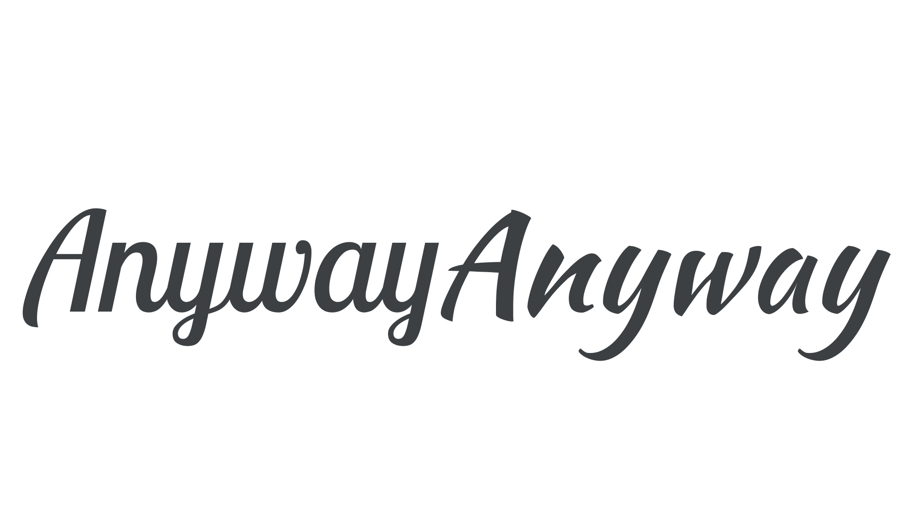

Choosing [typefaces](/glossary/typeface) designed by the same [type designer](/glossary/type_designer) or [type foundry](/glossary/type_foundry) makes life a little easier when [pairing type](/topic/pairing_type). While it’s certainly a generalization, we often find that type designers have certain stylistic ways of drawing [letterforms](/glossary/letterform), and certain technical ways of creating [font](/glossary/font) files.

If two artists are drawing the same exact object—for instance, an apple—in the same exact medium, they will still produce very different results because of the micro decisions they make as they try to accurately render the apple. Those familiar with the artists’ work would be able to tell their work apart. The same is true for type designers, whose “hand” is possible to spot in their typefaces.

And, because many type foundries are run by one person (or at least a very small team), the rule can usually be extended to an entire foundry.

Let’s look at some examples:

## [Epilogue](https://fonts.google.com/specimen/Epilogue?query=epilogue) & [Anybody](https://etceteratype.co/anybody), by Etcetera Type Company

<figure>

</figure>

[//]: # (We should expand upon this more by being specific about the similarities we can see.)

## [Lobster Two](https://fonts.google.com/specimen/Lobster+Two?query=Lobster+Two) & [Kaushan Script](https://fonts.google.com/specimen/Kaushan+Script?query=Kaushan+Script), by Impallari Type

<figure>

</figure>

[//]: # (We should expand upon this more by being specific about the similarities we can see.)

As always, we must treat this generalization with care—we can’t *assume* that will be shared elements—but it can be a useful way of narrowing down the myriad choices that face us when choosing a secondary typeface.

It’s also worth noting that different designers can also have a “similar hand” to one another; these stylistic similarities can be used to pair typefaces from two different designers or foundries.
