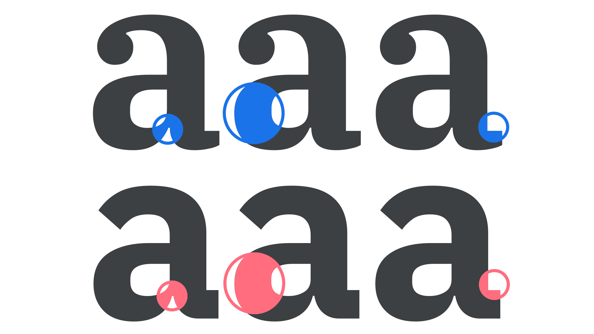

In our introductory article [“Pairing typefaces,”](/lesson/pairing_typefaces) we introduce at the idea of looking at other [fonts](/glossary/font) within a [family](/glossary/family_or_type_family_or_font_family) as a way of making life a little easier when pairing [type](/glossary/type). In *this* article, we’ll explore that method in more detail, especially with regard to [superfamilies](/glossary/superfamily): The collective grouping of several explicitly related type families—such as a [serif](/glossary/serif), [sans](/glossary/sans_serif), and [slab](/glossary/slab_serif_egyptian_clarendon)—that all share the same underlying structure to their design. Using superfamilies allows us to swap fonts without disrupting our layouts, which saves us time and complexity.

Before we get going, we should briefly address the fact that the exact definition of a family and superfamily varies between [foundries](/glossary/type_foundry). Superfamilies tend to incorporate a pairing of at least a serif and sans serif, but they might also stretch to a slab serif or [monospaced](/glossary/monospaced) companion, and include multiple [widths](/glossary/width) and perhaps even [optical styles](/glossary/optical_sizes). Here we’re referring to a family as a grouping of explicitly related typefaces that share a common skeletal structure, and a superfamily as a *larger* grouping that ranges across more styles.

With a variety of options in a family and—in theory—a multitude of options in a superfamily, we have enough contrast at our disposal to not require a pairing from another typeface. And the advantage of staying within the family means there’s a shared consistency across every variation.

<figure>

<figcaption>The skeletal structure is almost identical across sans serif and slab serif faces in the same type family.</figcaption>

</figure>

However, it’s not simply the skeletal structure that’s shared across the different fonts: we’ll also benefit from the same spacing settings, the same proportions, and the same motifs being used throughout the designs.

<figure>

<figcaption>Note the motifs such as ink traps, proportions of the thickest strokes, and angles shared between the serif and sans.</figcaption>

</figure>

From a font production point of view, there’ll be plenty of shared elements across the family, too, with glyphs likely sharing the same or similar vertical metrics within the [em square](/lesson/exploring_x_height_the_em_square). A shared [x-height](/glossary/x_height) is likely, although note that this will naturally change between optical size. (Even so, the x-height of a display optical size in the serif should match the x-height of a display optical size in the sans.)

[//]: # (Above, link to VERTICAL METRICS article / glossary term when live.)

<figure>

</figure>

Here are some ideas for potential pairings. While we’re only showing two options in each, it goes without saying that the multiple weights and styles available within each family and superfamily allow for the easy creation of a robust typographic system.

## [Merriweather](https://fonts.google.com/specimen/Merriweather) & [Merriweather Sans](https://fonts.google.com/specimen/Merriweather+Sans)

<figure>

</figure>

## [Roboto Slab](https://fonts.google.com/specimen/Roboto+Slab) & [Roboto Mono](https://fonts.google.com/specimen/Roboto+Mono)

<figure>

</figure>

## [Nunito](https://fonts.google.com/specimen/Nunito) & [Nunito Sans](https://fonts.google.com/specimen/Nunito+Sans)

<figure>

</figure>

## [Quattrocento](https://fonts.google.com/specimen/Quattrocento) & [Quattrocento Sans](https://fonts.google.com/specimen/Quattrocento+Sans)

<figure>

</figure>

A great example of a superfamily is [Breve, by DSType](https://www.dstype.com/fonts), which contains a serif, a sans, a slab, and an additional serif with newspaper-like features called “News”. It also offers Text and Title optical sizes for each, and—as a further extra—a separate Display face for very large sizes.

<figure>

</figure>

A superfamily like Breve offers so many options, in many scenarios it would make very little sense to try and pair a typeface from a different family. One example might be the addition of a completely unrelated style, such as script or handwritten-style type, to add a very direct contrast in terms of tone.

<figure>

</figure>

However, as we’ve emphasised in all [type pairing articles](/topic/pairing_type), we should only introduce a secondary typeface if it can do something our primary typeface cannot.
