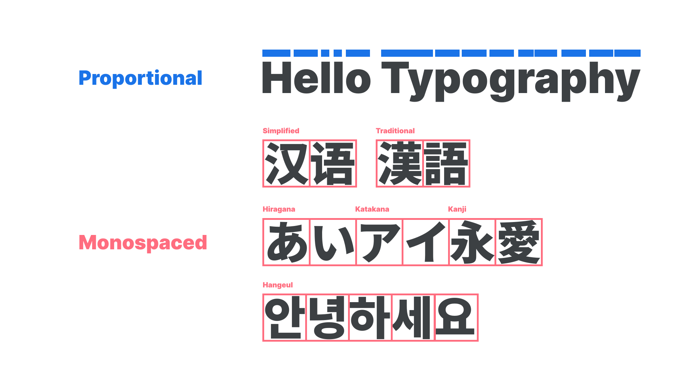
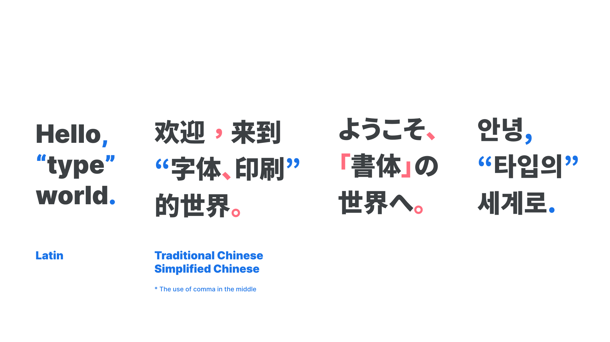
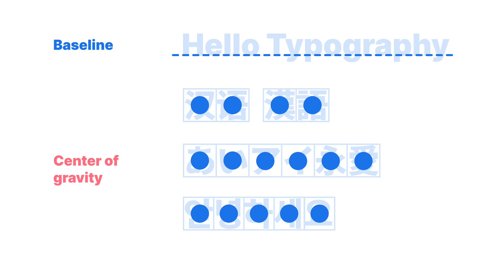
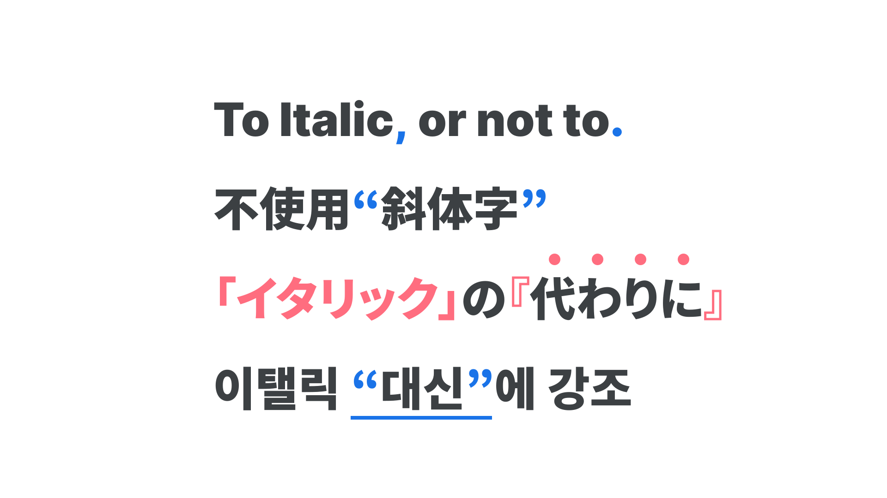

There are four big differences in rules of typesetting between [Latin](/glossary/latin) and [CJK](/glossary/cjk) [fonts](/glossary/font):

## 1. Full-width, monospaced

Latin fonts are mostly proportional by default, but most CJK fonts are [monospaced](/glossary/monospaced). Chinese and Japanese fonts are designed to fit the full [em square](/glossary/em). Some Japanese fonts have smaller [widths](/glossary/width) for narrower [typesetting](/glossary/typesetting), but the default for Japanese fonts is monospaced. Korean fonts are little more complicated—Hangeul, the Korean script, is monospaced by default, but the punctuation is proportional because Korean fonts use Latin punctuation and also wordspacing system (see point 3). While Chinese and Japanese monospaced fonts are usually full-width, a recent trend in Korea is to make the letter width narrow, around 850–950 units, for smoother readability and smarter looks. 

<figure>

</figure>

## 2. Use of punctuation

CJK scripts have a special punctuation in common called “full-width punctuation.” This is used in all CJK fonts, but the usage differs among them. 

In Japanese, full-width punctuation is used by default, with Latin punctuation used only in special cases, such as dissertation papers. 

<figure>

</figure>

In Chinese, both Latin and full-width punctuations are used, but with Traditional Chinese usage in Hong Kong and Taiwan, commas are placed in the middle of the letter height. Latin punctuation and full-width punctuation are all used in a different meaning and purpose.

In Korean, the default punctuation is Latin, and no full-width punctuation. For brackets, full-width punctuation is allowed, but only in limited special scenarios. For example, when noting bibliographic references, both 「」and『』are used. However, commas and periods are strictly Latin (shape-wise), and full-width punctuation is never used in that position. And for the wordspaces and Latin punctuation, most Korean fonts have a Korean version of those characters, with a better size and baseline, because regular Latin punctuation does not usually align well with Hangeul.

<figure>

</figure>

## 3. Balance of the type: center of gravity, instead of the baseline

CJK fonts do not have a concept of baseline. The idea is that the balance of the type exists roughly in the center of the em square (remembering that that box is not necessarily a square if the font is proportional), and try to find the right center of gravity depending on the design of the typeface and the writing direction. Usually the balance is set in the center, but sometimes gravity shifts up and down. Usually when the gravity is high, the font is likely to look more sophisticated and elegant, and when it’s low, more casual.

<figure>

</figure>

## 4. No italic

In CJK scripts and fonts, there are no italics. Designs are sometimes [faux-ialicized](/glossary/faux_fake_pseudo_synthesized)for design purposes, but originally, italics do not exist. Instead, designers come up with creative solutions. Most of the time, single and double quotation marks or full-width brackets are the common and easy way used to indicate emphasis. Little dots on top of the letters are also used a lot, but only when there is no Ruby. Underlines are also used, but more for subtitles than emphasis in the middle of the paragraph. If the design allows, wavy or highlighted underlines are also used. Bold or coloring the words are preferred solutions, too.

<figure>

</figure>
